# Typora 常用快捷键

## 标题快捷键

1. ctrl + 1 一级标题
2. ctrl + 2 二级标题

## 代码块

```
ctrl shift k 代码块快捷键
```

```java
```java java语言代码块
```

```shell
```shell shell语言代码块#tab 键上面的一个键，按 shift 切换成英文
```

## 列表

1. 有序列表

   ```java
   //有序
   ctrl + shift + [
   ```

2. 无序列表

   ```java
   //无序
   ctrl + shift + ]
   ```

## 缩进

1. 增加缩进
   - ctrl + ] 增加缩进
2. 减少缩进
   - ctrl + [ 减少缩进

## 常用操作

```java
ctrl + c //拷贝
ctrl + v //粘贴
ctrl + x //剪切
ctrl + z //撤销
```

## 文字格式

1. 加粗
   - ctrl + b
2. 斜体
   - ctrl + i
3. 下划线
   - ctrl + u


# dos 命令以及常见的系统快捷键

1. dos 命令

   - 键盘

     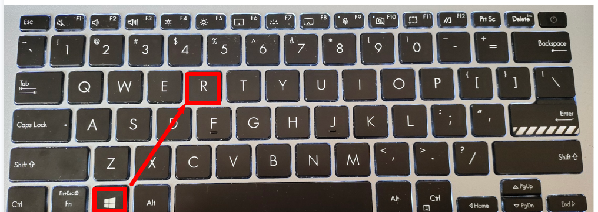

   - 打开运行窗口

     

   - 常见命令

     - win + r //打开cmd

       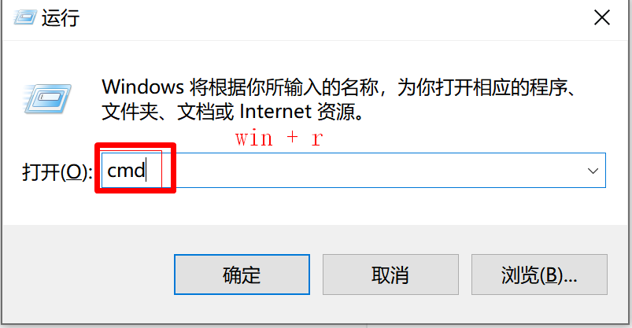

     - ipconfig //查看ip

       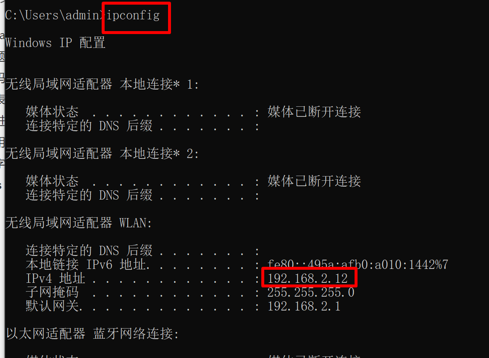

     - cls //清屏

       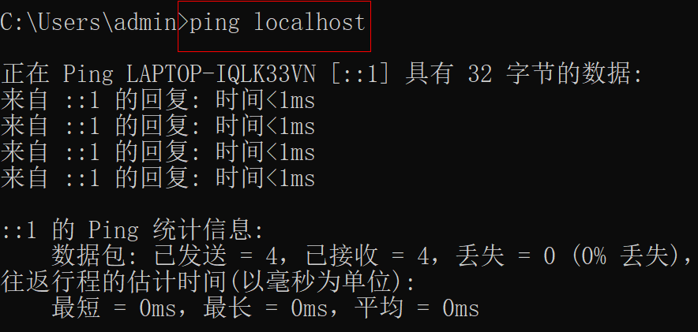

     - ping //查看ip 通否

       

     - p盘符：去对应的盘符

       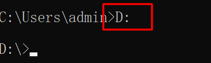

     - cd javase 去 javase 目录

       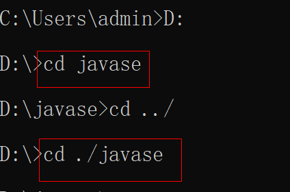

   - 系统常见快捷键

     - win + e 打开我的电脑
     - win + d 快速回到桌面
     - win + L 锁屏
     - alt + tab 切换窗口

# java 概述

1. 计算机的组成
   - 硬件：CPU、内存、硬盘、主板
   - 软件：系统软件，应用软件

2. 计算机语言发展史

3. java语言发展史

4. java 语言特点

   - 简单性，没有指针的概念，不允许通过指针操作内存，只支持单继承

   - java 跨平台

     - 平台：windows linux mac

     - java 可以运行到任何操作系统之上

     - 实现跨平台需要java 虚拟机 jvm

       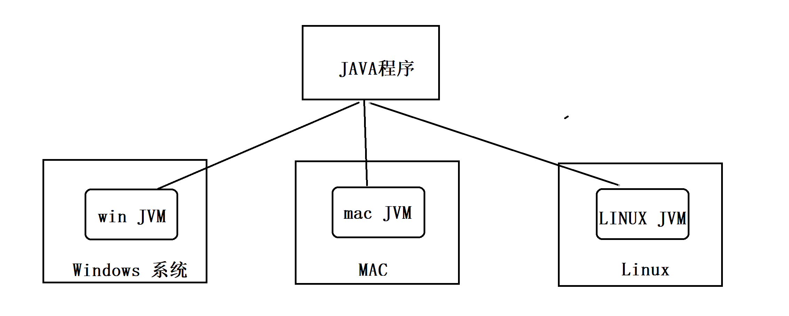

# jdk 安装

1. jdk 安装

   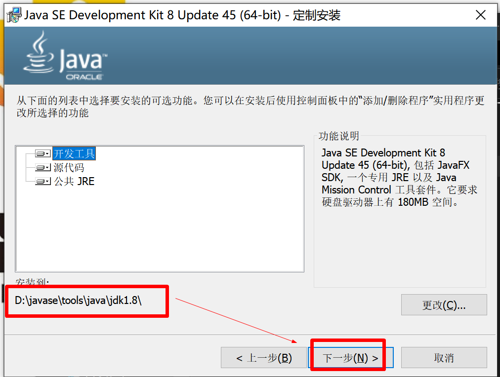

   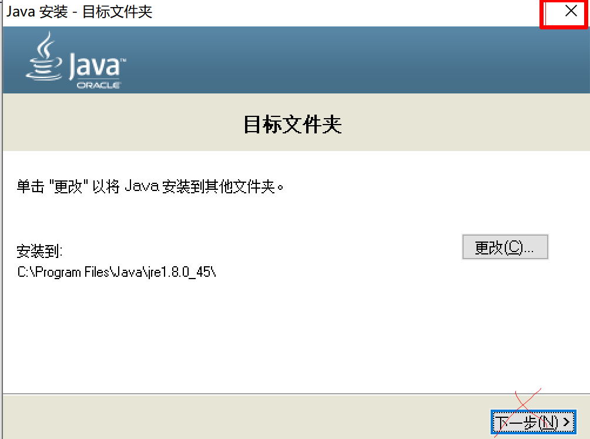

   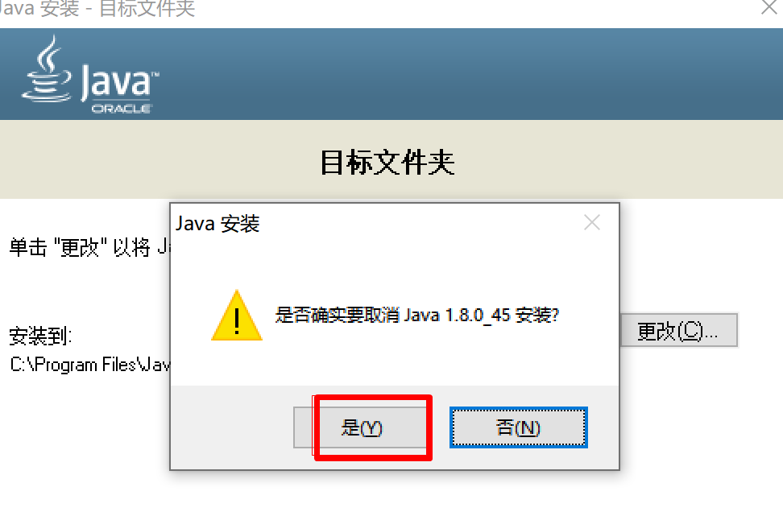

   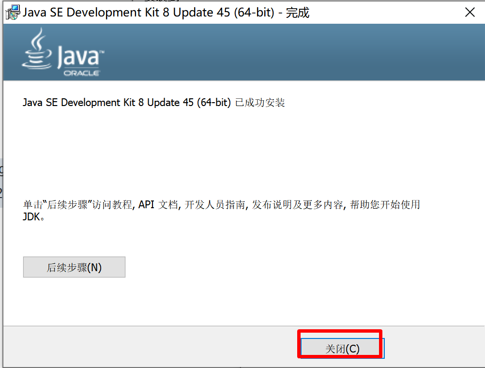

   

   

# 环境变量

1. 环境变量的配置

   - 此电脑-右键属性-高级系统设置-环境变量-配置 JAVA_HOME-配置path-%JAVA_HOME%\bin

   - 测试 java -version javac -version

     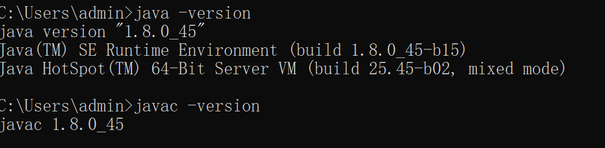


# jdk 与 jre 关系

1. jdk: 它是java的开发运行环境，开发人员需要安装jdk
2. jre: java runtime environment(java 运行环境)，如果只需要运行程序，不需要开发，可以只安装jre
3. jdk 包含了 jre


# java 加载和执行的过程

1. 图解

   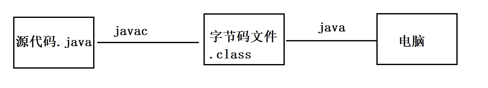

2. java 源文件：程序员编写的，扩展名是以.java 结尾的
3. 编译：通过 javac 把java源文件编译成字节码文件（.class结尾）
4. 运行：通过解释器（java）运行字节码文件
5. 需要用到 dos 命令


# java 第一个程序 HelloWorld.java

1. 建好作业的包，practice 是课堂练习，task 是作业

2. 新建文件 HelloWorld.txt

3. 编写源代码(shift + [)

   ```java
   public class HelloWorld{
       public static void main(String[] args){
           System.out.println("HelloWorld");
       }
   }
   ```

4. 代码分析

   - 最外层分析

     ```java
     public class HelloWorld{
     //public 代表公共的，是一个修饰符
     //class 带表类的关键字
     //HelloWorld 类名
     //{}
     }
     ```

   - 中间层

     ```java
     public static void main(String[] args){
     //public 代表公共的，是一个修饰符
     //static 代表静态的，是一个关键字
     //void 代表没有返回类型
     //main 带表程序入口
     //String[] args 代表数组，程序参数
     }
     ```

   - 内层

     ```java
     System.out.println("HelloWorld");//输出语句，输出 HelloWorld
     ```

5. 常见错误

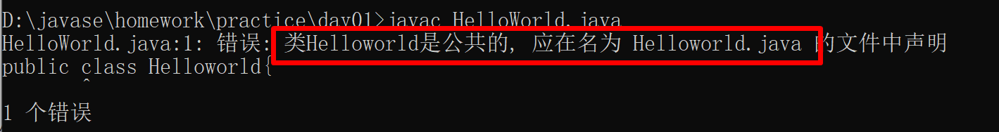

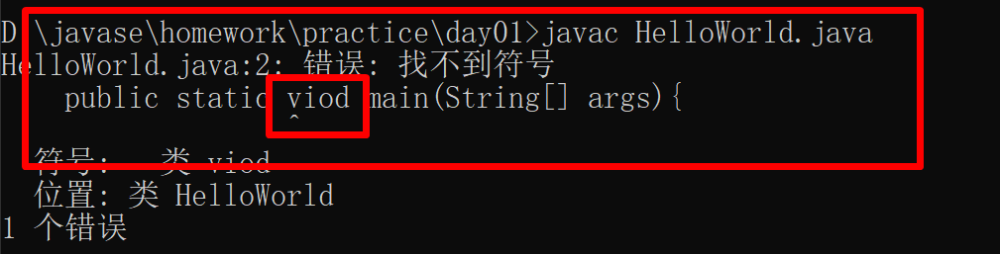

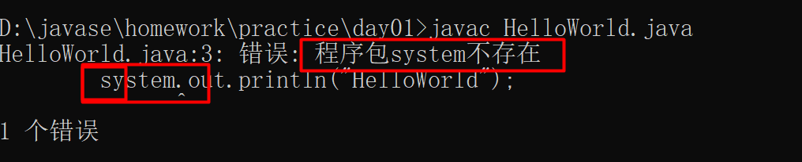

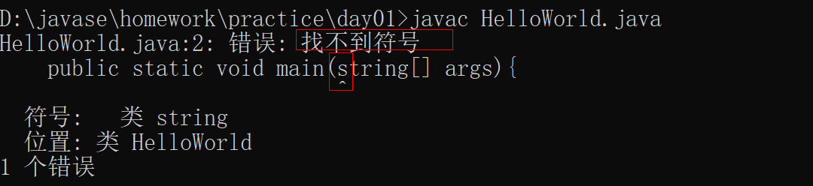

6. 正常情况

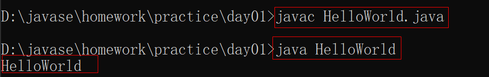

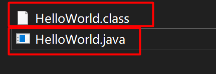

