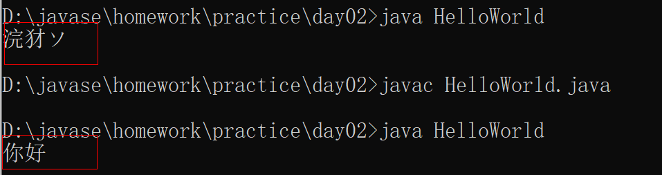
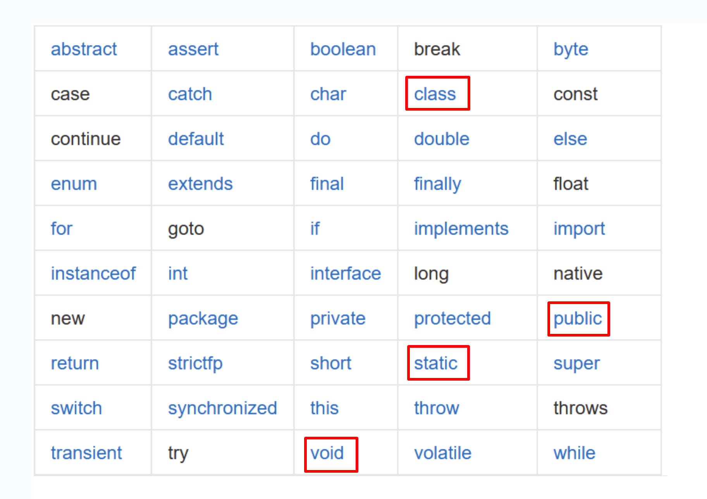
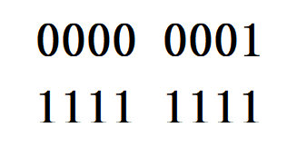
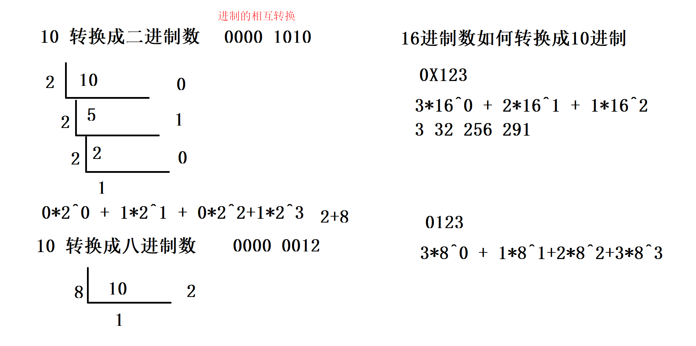
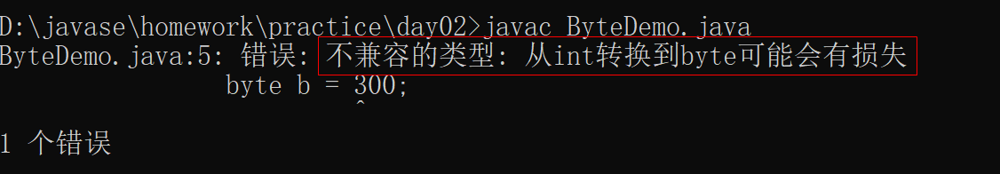
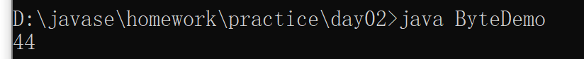
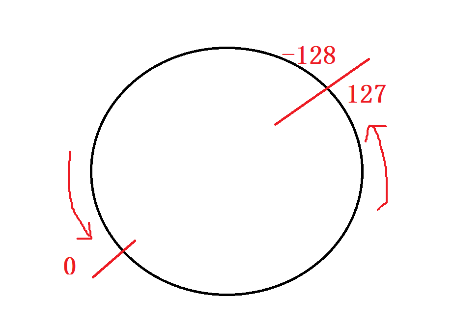

# notepad++ 的安装和使用

1. 打开java 文件进行编辑，编辑完成记得 ctrl + s 保存

2. 编码：

   - 右下角出现 Utf-8(导致乱码)

   - 修改成 GB2312（编码->编码字符集->中文->GB2312）

     

# Java注释、关键字、标识符

## java 注释

1. 通常我们需要在源代码中添加文字去描述我们代码的作用，做一个解释说明，直接写就会报错，所以我们就可以用java 的注释来解决这一问题
2. java 提供了三种注释方式：
   - 单行注释  //注释内容
   - 多行注释 /* 注释内容 */
   - 文档注释 /** 注释内容 */

## 关键字



1. 关键字是我们 JAVA语言一些特殊的字母，具有特殊含义，java 中关键字是小写字母开头


## 标识符

1. 标识符就是名称的意思，定义类，包，方法，变量名，目的是有一个号的命名。

2. 标识符的组成：

   - 英文的大小写字母 a-z A-Z
   - 数字 0-9
   - 符号 _ 与 $

3. 标识符规则

   - 数字不能打头

   - 不可以使用关键字

   - 严格区分大小写，做到见名知意

   - 驼峰命名法（类名第一个单词的首字母大小，其它单词的首字母也大小）

     ```java
     public class StudentTest{
       //驼峰命名法  
     }
     ```

     

# 计算机的存储单元

1. 计算机的内存是如何存储数据？计算机的最小存储单元叫字节（byte）可以用大写字母B来表示,计算机存储设备的最小信息单元叫位（bit）小写字母b来表示。

   

2. 存储单元：

   - 1B（字节）= 8位
   - 1KB = 1024B
   - 1MB = 1024KB
   - 1GB = 1024MB
   - 1TB = 1024GB

## 进制换算

1. 十进制数 0 ，1 ，4，9

2. 二进制数 0,1

3. 八进制数 (0) 0,1,7

4. 十六进制（0X） 0,9，A,B,C,D,E,F

5. 十进制数转换成二进制数

   

# 数据类型

1. 基本数据类型

   |  四类  |    八种     | 字节数 |        数据范围         |
   | :----: | :---------: | :----: | :---------------------: |
   |  整型  |    byte     |   1    |        -128-127         |
   |        |    short    |   2    |      -32768～32767      |
   |        |     int     |   4    | -2147483648～2147483648 |
   |        |    long     |   8    |      -2^63～2^63-1      |
   | 浮点型 | float(f,F)  |   4    |     -3.403E--3.403E     |
   |        | double(d,D) |   8    |                         |
   | 字符型 |    char     |   2    |       'a','A','1'       |
   | 布尔型 |   boolean   |   1    |       true,false        |

   

2. 引用数据类型
   - String (字符串)
   - 其它的引用数据类型（数组，类）

## 基本数据强制类型转换

1. 需求：定义一个byte 类型的数，并且给一个值为300；

2. 问题

   

3. 解决：强制类型转换前面加上（数据类型）

   ```java
   byte b = (byte)300;
   ```

   

4. 需求2：给byte 类型的数赋值 128

5. 问题：超过给定数据范围，就会循环

   