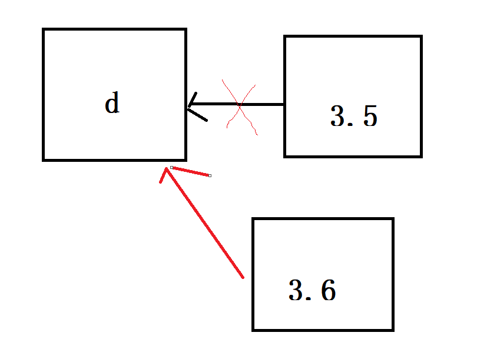
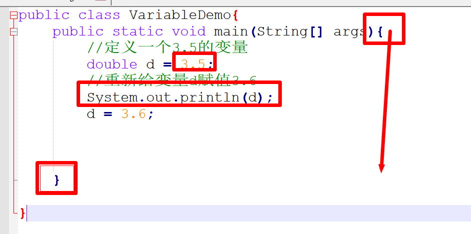
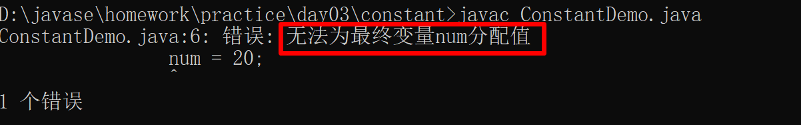
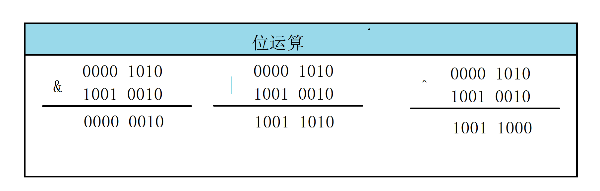

# 变量

定义格式：

```java
数据类型 变量名 赋值符号 数值
   int   num    =     10;
```

代码演示：

```java
public class VariableDemo{
    public static void main(String[] args){
        //定义一个3.5的变量
        double d = 3.5;
        d = 3.6;
        
    }
    
}
```



注意：程序是从上往下执行的流程，没有执行到的不管。



# 常量

定义：永远不会变的量，10,10.3,1000L

```java
public class ConstantDemo{
    public static void main(String[] args){
        
        System.out.println(10);
    }
    
}
```

**注意**：使用 final 修饰的变量也是常量，并且不能重新赋值

```java
public class ConstantDemo{
    public static void main(String[] args){
        
        System.out.println(10);
        //之前定义的变量,前面加 final 关键字以后就变成常量
        final int num = 10;
    }
    
}
```



# 运算符

## 算术运算符

1. 运算符用来计算数据的，数据可以是常量，也可以是变量，被我们运算符操作的数，我们称之为操作数

2. 算术运算符+、-、*、/、%、++、--

   | 运算符 | 运算规则 |        例子         |    结果    |
   | :----: | :------: | :-----------------: | :--------: |
   |   +    |   正号   |         +10         |     10     |
   |   +    |   加法   |        10+12        |     22     |
   |   +    |  连接符  |   “名字：”+“上云”   | 名字：上云 |
   |   -    |   负号   |         -10         |    -10     |
   |   -    |   减法   |       20 - 10       |     10     |
   |   *    |   乘法   |        10*2         |     20     |
   |   /    |    除    |      6/3(5/2)       |     2      |
   |   %    |   取模   |         5%2         |     1      |
   |   ++   |   自增   | int a = 1;a++/++a;  |     2      |
   |   --   |   自减   | int b = 2; b--/--b; |     1      |

   注意：

   - 前置++ 先+1 后运算（后做操作），后置++ 先操作后+1；
   - 前置-- 变量先-1，后操作，后置-- 先操作，变量后-1；

## 赋值运算符


1. 赋值运算符，用来为变量赋值的。=、+=、-=、*=、/=、%=

   | 运算符 |  运算规则  |            例子            | 结果 |
   | :----: | :--------: | :------------------------: | :--: |
   |   =    |  赋值符号  |        int a = 10;         |  10  |
   |   +=   |  加后赋值  | int a = 10; a+=2;(a = a+2) |  12  |
   |   -=   |  减后赋值  |     int a = 10; a-=2;      |  8   |
   |   *=   |  乘后赋值  |      int a = 10;a*=2;      |  20  |
   |   /=   |  除后赋值  |      int a = 10;a/=5;      |  2   |
   |   %=   | 取模后赋值 |      int a = 10;a%=3;      |  1   |

## 关系运算符


1. 关系运算符又叫比较运算符，用来判断两个操作数大小关系，以及是否相等，结果是我们boolean 类型，true false 

   | 运算符 |   运算规则   | 例子  | 结果  |
   | :----: | :----------: | :---: | :---: |
   |   >    |     大于     | 5 > 3 | true  |
   |   >=   | 大于或者等于 | 5>=5  | true  |
   |   <    |     小于     |  5<3  | false |
   |   <=   |   小于等于   | 3<=4  | true  |
   |   ==   |     等于     | 3==3  | true  |
   |   !=   |    不等于    | 3!=4  | true  |

2. 注意：赋值运算的 = 和关系运算符的 == 是有区别的，= 是做赋值， == 是做判断比较。

   ```java
   int a = 5;
   int b = 10;
   System.out.println( a == b);
   System.out.println(a = b);
   ```

   

## 拓展内容

二进制运算的原码，反码，补码(Integer.toBinaryString())

- 原码：1  00000000 00000000 00000000 00000001

- 反码 ：1 00000000 00000000 00000000 00000001

- 补码： 1 00000000 00000000 00000000 00000001

  ```java
  -1这个数的原码、反码、补码
      原码
      	10000000 00000000 00000000 00000001
      反码
      	11111111 11111111 11111111 11111110
      补码 = 反码 + 1
      	11111111 11111111 11111111 11111111
  ```


## 逻辑运算符

1. 逻辑运算符，用与 boolean 类型的值进行运算比较的。最终结果 true 或者是 false(按住 shift + 对应符号)

   | 运算符 |        运算规则        |       例子       | 结果  |
   | :----: | :--------------------: | :--------------: | :---: |
   |   &    |     与（两者为真）     |   true & false   | false |
   |   \|   |   或(有一个真即为真)   |  true \| false   | true  |
   |   ！   |       非（取反）       |      !true       | false |
   |   ^    | 异或（两者不同即为真） |   true ^ false   | true  |
   |   &&   |         短路与         |  false && true   | false |
   |  \|\|  |         短路或         | true \|\| false  | true  |
   |   ^    |    异或做二进制运算    | 二进制无进位相加 |       |

## 条件运算符

boolean ？ 值1：值2；

```java
true?"你好"："不好";
```


## 位运算符

当你使用数字操作位运算符时，是使用二进制操作的。

位运算符(1=true,0=false)：

- &(与)  1&1=1,1&0=0

- |（或）1|1=1,1|0=1,0|0=0

- ^(异或) 1^1=0,1^0=1,0^0=0

- 〜(取反) ~1=0，~0=1（二进制元素位）

  ```java
  0000 0001
  1111 1110
  ```

- << （左移）左移一位相当于乘以2，右移一位相当于除以2

  ```java
  0000 0001
      <<2
  0000 0100
      
      >>1 右移
  0000 0010
      >>1
  0000 0001
  无符号右移 >>>
  
  ```



# idea 的安装以及使用

1. 项目和模块之间的关系：project --> 多个模块 --->多个包 --->多个类（包用域名倒着写）www.baidu.com com.baidu
2. www.sycoder.cn  cn.sycoder
3. idea 快捷键的讲解（目前常用的）

|      说明      |          快捷键          |
| :------------: | :----------------------: |
|     主方法     |           psvm           |
|    单行注释    |         ctrl + /         |
|    多行注释    |       ctrl+shift+/       |
|    文档注释    |       /** + enter        |
|  打印输出语句  |           sout           |
|    删除一行    |         ctrl + y         |
|    复制一行    |         ctrl + d         |
|   代码格式化   |       ctrl +alt +L       |
|     重命名     |        shift + f6        |
|    多行输入    |      alt +鼠标左键       |
|    上下移动    | shift + alt + 方向上下键 |
| 自动生成变量名 |      ctrl + alt + v      |
|                |                          |
|                |                          |
|                |                          |
