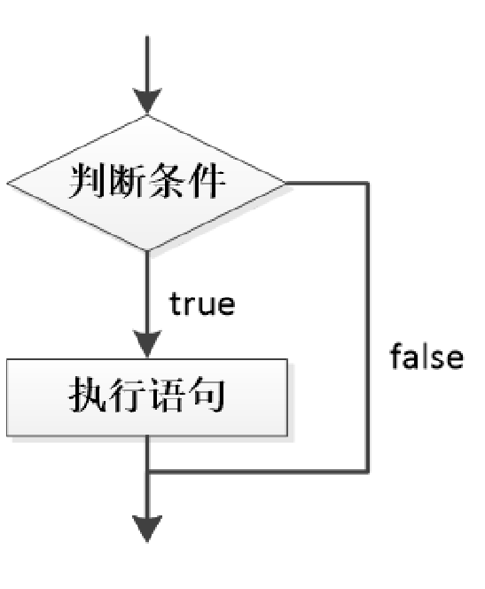
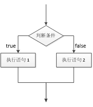
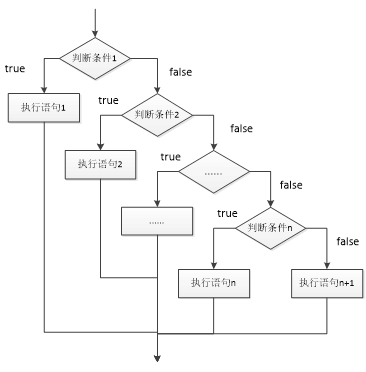
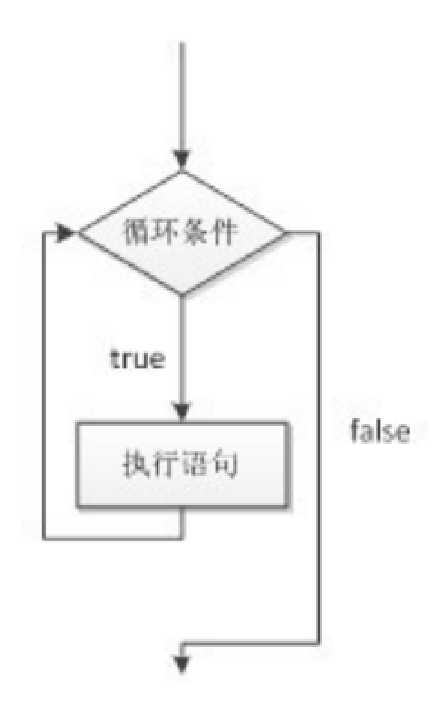
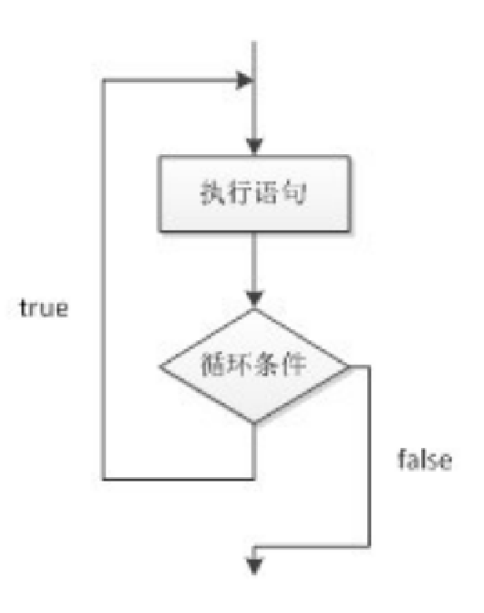

# 条件与循环语句

## 选择结构 if

1. if 的定义

   ```java
   if(boolean){
       //如果条件是 true执行代码块
   }
   //需求 如果考试得了一百分，奖励手机
   ```

   

2. if...else 语句

   ```java
   //定义
   if(boolean){
       //语句块1
   }else{
       //语句块2
   }
   //如果条件满足，执行语句块1，否则执行语句块2
   
   //需求：如果考试得100奖励一个手机，否则，家庭作业翻倍
   
   ```

   

   

3. if ... else if... else if ...else(只选其中一条路走)

   ```java
   //语法定义
   if(boolean){
       //语句块1
   }else if(boolean){
       //语句块2
   }else if(boolean){
       //语句块3
   }else{
       //语句块4
   }
   
   //需求：考90分以上 等级A，[80-90) B  [70-80) c [0-70)d
   
   ```

   

   

注意：最多只有一个分支执行，如果有 else 那一定分支执行

## 选择结构 Switch

1. 定义

   ```java
   switch(表达式){
    case 目标值：
        执行语句
        break;
    case 目标值：
        执行语句
        break;
    case 目标值：
        执行语句
        break;
       default:
           执行语句
   }
   
   //需求：int week = 1;1 打印星期1,2打印星期2 7打印星期天
   ```

   

## 循环结构

### while 循环

1. 循环：重复相同的步骤

   ```java
   //定义
   while(boolean){
       代码块
   }
   
   //需求1：播放音乐10次
   //需求2：定义一个变量，从0开始，当变量小于5的时候，计算变量之间的和
   ```



### do...while

1. 先做一次，再判断

   ```java
   do{
       语句块
   }while(boolean);
   
   //需求：不管你之前听音乐听多了多次，当我判断的时候都要一次 播放音乐<10;
   ```

   



### for 循环

1. for 循环的定义

   ```java
   for(表达式1;表达式2;表达式3){
       语句
   }
   
   for(①；②；③){
    ④   
   }
   ⑤
       
   执行流程
       第一步：先执行①
       第二步：其次②
       第三步：执行④
       第四步：执行③
       第五步：回到②
       最后：  执行5
   //需求：求1-5的和
   ```

### 嵌套循环

特点：最外层的循环执行一次，里面全部执行完，再继续去执行最外层的代码。

```java
for(表达式1;表达式2;表达式3){
    for(表达式1;表达式2;表达式3){
    	语句
	}
}

//用 * 打印一个直角三角形

```


## break 

1. 在switch条件语句和循环语句中都可以使用break语句。当它出现在switch条件语句中时，作用是终止某个case并跳出switch结构。

   - 需求：定义一个变量num = 1,当num 大于10的时候，循环停止

2. 标记语法

   ```java
   可以指定break 跳转到某一层循环
   ```

   

## continue

1. 终止本次循环，继续往下执行
   - 需求：对1~100之内的奇数求和

注意：continue 是停止本次循环，继续执行下一次循环，而break 是整体把循环结束


