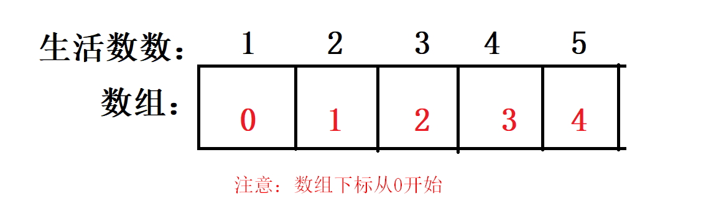
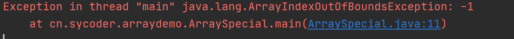
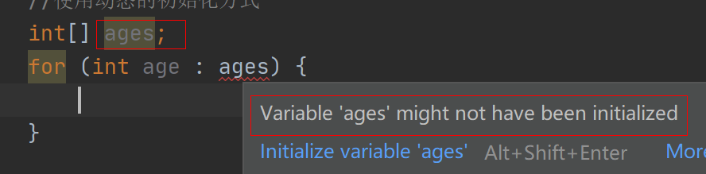
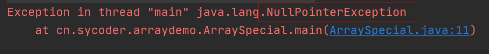
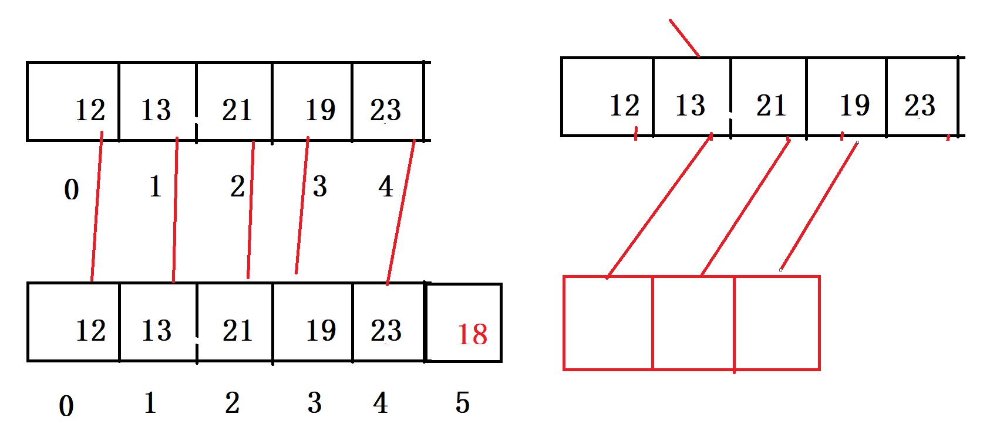
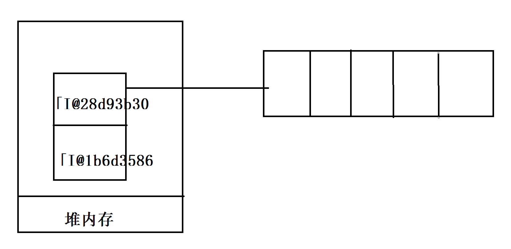
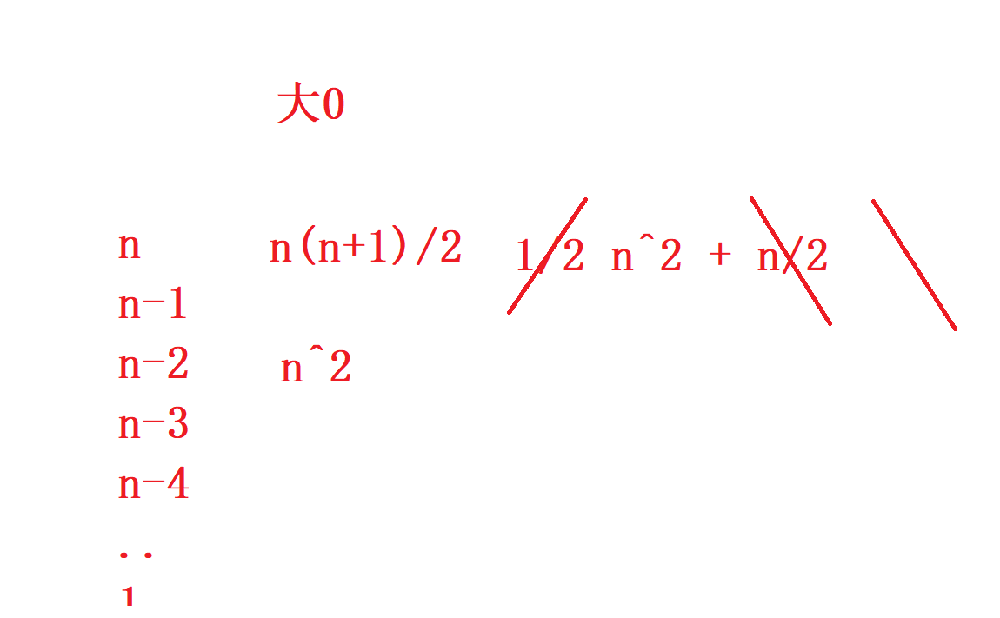

# 数组

1. 在生活中，会遇到如下场景，需求：统计班级学生数量，计算学生的平均年龄，找出学生最老的，找出学生最小的。
   - 假如我们班有35个人，需要35个变量来表示我们学生的年龄，这样做很麻烦而且很臃肿。
2. 数组的概念：一堆数的组合。20,21,23,20
3. **数组中 length 属性，就是数组的长度**
4. 数组的索引是从 0 开始的，也就是数组的下标，最大值是数组长度 -1，也就是 length -1
5. 数组长度一但固定，就不可变

## 数组的定义

1. 动态定义：数组初始化时，数组元素是空的，需要我们重新赋值才有数据。

   ```java
   数据类型[] 数组名称 = new 数据类型[元素个数];
   //样例
   int[] ages = new int[35];
   
   //赋值
   数组名称[对应的索引]
   ```



2. 静态定义：数组初始化的时候，就已经确定各索引元素的值

   ```java
   //方式1
   数据类型[] 数组名称 = new 数据类型[]{数据1,数据2，数据3};
   
   //方式2
   数据类型[] 数组名称 = {数据1,数据2，数据3};
   ```

3. 获取值，或者赋值

   ```java
   //给数组元素赋值
   数组名称[索引] = 值；
   //获取值
   数组类型 变量名 = 数组名称[索引];
   ```

   - length:数组的长度
   - 索引：从0开始，比length 少1

## 数组的遍历

1. 再操作数组时，经常需要去拿元素取元素，这种操作就是数组的遍历。

2. 遍历的语法

   ```java
   //for 循环 快捷键 fori
   for(int i =0;i<arr.length; i++){
       
   }
   //foreach 遍历
   数组变量名.iter
   for(数据类型 变量名:数组名称){
       
   }
   
   ```

3. foreach 底层其实还是使用我们的for 循环

## 数组的特点

1. 常见问题

   - 索引越界异常（没有再索引范围内）

     

   - 数组未初始化

     

   - 空指针异常

     

2. 数组元素存储的特点

   - 数组的元素数据类型必须一致（char 有 ASII码表对应）

   - 数组元素连续，空间大小一致，并且内存地址连续，呈现线性结构

   - 数组长度固定之后，不可改变

   - 数组不仅可以存储基本数据类型，还可以存储引用数据类型，数组本身就是引用数据类型

     ```java
     String[] strs = {"1","2","3"};
     ```

3. 优缺点

   - 优点
     - 根据索引去获取访问元素（快）
     - 能存储较多的数据
   - 缺点
     - 数组的长度固定，不可改变（超过容量增加数组元素时，只能用新数组代替）
     - 只能存储一种数据类型
     - 删除很慢，根据内容找索引很慢

## 数组的拷贝及其扩容

1. 需求：原数组不够放，新增加了元素，只能考虑扩容和拷贝

   ```java
    //原来5个同学的年龄
   int[] ages = {12,13,21,19,23};
   
   //新加入一个同学 18；
   int[] newAges = new int[ages.length + 1];
   for (int i = 0; i < ages.length; i++) {
       newAges[i] = ages[i];
   }
   newAges[newAges.length - 1] = 18;
   for (int newAge : newAges) {
       System.out.println(newAge);
   }
   ```

   

2. 需求2：从源数组某一个位置开始拷贝，拷贝某一个长度到目标数组里面去

   ```java
   //从源数组的第2个元素，拷贝3个元素到新数组里面去
    //需求2的实现13,21,19
   int[] ages2 = {12,13,21,19,23};
   int[] newAges2 = new int[3];
   //第二个元素
   int srcPos = 1;
   //拷贝多长
   int index = 3;
   //目标数组的起始位置
   int destPos = 0;
   for (int i = srcPos; i < srcPos + index; i++) {
       //新数组从 destPos 开始拷贝，每次递增
       newAges2[destPos++] = ages2[i];
   }
   System.out.println("-----");
   for (int newAge : newAges2) {
       System.out.println(newAge);
   }
   ```

   

## 数组的工具类 Arrays 简单了解

1. 需求：int[] ages = {1,3,4,5,6}; 打印输出的时候，[1,3,4,5,6];

   ```java
   int[] ages = {1, 3, 4, 5, 6};
   //最后字符串结果
   String ret = "[";
   for (int i = 0; i < ages.length; i++) {
       //如果当前元素是最后一个元素，就不添加,
       if (i == ages.length - 1) {
           ret += ages[i] +"]";
       } else {
           ret += ages[i] + ",";
       }
   
   //            ret += i == ages.length - 1?ages[i] +"]":ages[i] + ",";
   }
   System.out.println(ret);
   ```

2. Arrays工具类

   ```java
   int iMax = ages.length - 1;
   String str = "[";
   for (int i = 0; ; i++) {
       str += ages[i];
       if(i == iMax){
           str+="]";
           break;
       }
       str+=", ";
   }
   ```

   

## 二维数组

定义：二维数组，就是数组中有数组

```java
//一维数组
int[] arr = new int[10];
//动态定义
int[][] arr2 = new int[2][3];
//静态定义
int[][] arrays = new int[][]{{1,2,3},{4,5}};
int[][] arrays = {{1,2,3},{1,4}};

```

遍历：第一层拿到里面的数组元素（数组），第二层拿到具体的值



# 简单算法

1. 元素位置交换，需求：定义两个变量，交换两个变量的值

   ```java
   //方式1中间变量
   int a = 10;
   int b = 20;
   int temp = a;
   a = b;
   b = temp;
   
   //方式2不使用中间变量
   int c = 2;
   int d = 3;
   c = c^d;
   d = c^d;
   c = c^d;
   ```

### 冒泡排序

1. 做相邻比较

```
public static void main(String[] args) {
        int[] heights = {9, 2, 6, 7, 4, 1};
        //第几轮比较
        for (int i = 0; i < heights.length - 1; i++) {

            //相邻比较
            for (int j = 0; j < heights.length - 1 - i; j++) {
                //做交换
                if (heights[j] > heights[j + 1]) {
                    heights[j]^=heights[j+1];
                    heights[j+1]^=heights[j];
                    heights[j]^=heights[j+1];
                }
            }

        }

        System.out.println(Arrays.toString(heights));
    }
```



### 选择排序

```java
public static void main(String[] args) {
        int[] heights = {9, 2, 6, 7, 4, 1};
        //最外层控制找到的最小元素
        for (int i = 0; i < heights.length - 1; i++) {
            //定义一个元素，不停的去找最小值
//            for (int j = i; j < heights.length - 1; j++) {
//                if (heights[i] > heights[j+1]){
//                    heights[i]^=heights[j+1];
//                    heights[j+1]^=heights[i];
//                    heights[i]^=heights[j+1];
//                }
//            }
            for (int j = i + 1; j < heights.length; j++) {
                if (heights[i] > heights[j]) {
                    heights[i] ^= heights[j];
                    heights[j] ^= heights[i];
                    heights[i] ^= heights[j];
                }
            }
        }
        System.out.println(Arrays.toString(heights));
    }
```

### 二分查找法

1. 要求：要求数组元素是有序的

   ```java
   public static void main(String[] args) {
           int[] arr = {1, 2, 3, 5, 6, 8, 9, 11, 12, 16};
           //目标寻找的数
           int num = 16;
           //从哪开始找（索引位置）
           int min = 0;
           //到哪结束（索引位置）
           int max = arr.length - 1;
   
           while (min <= max) {
               System.out.println("min: " + min);
               System.out.println("max: " + max);
               //找一半
               int mid = (min + max) >> 1;
               //中间元素的值
               int midValue = arr[mid];
               if (midValue < num) {
                   min = mid + 1;
               } else if (midValue > num) {
                   max = mid - 1;
               } else {
                   System.out.println("找到了，当前元素的位置是：" + mid);
                   break;
               }
           }
   
   
       }
   ```

   