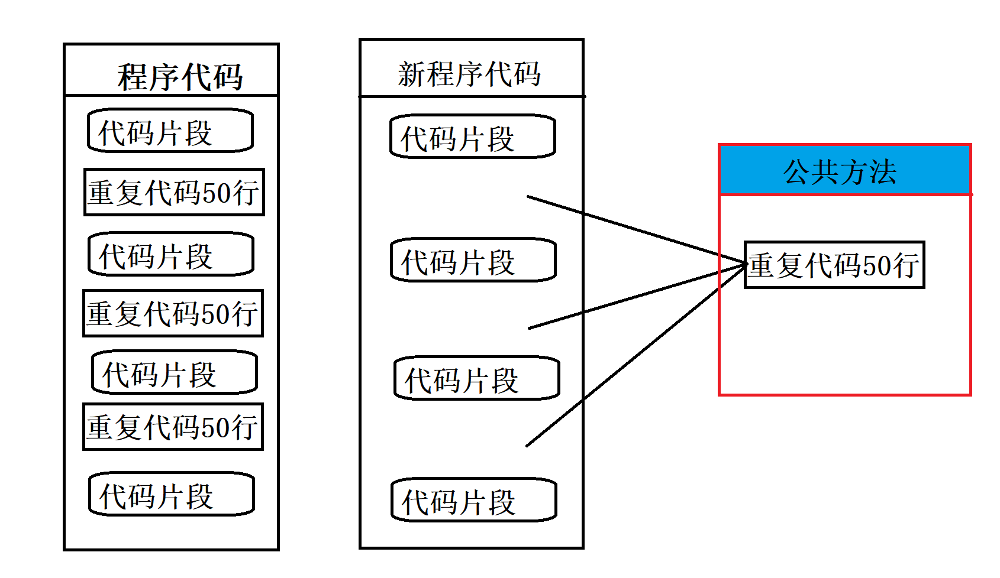
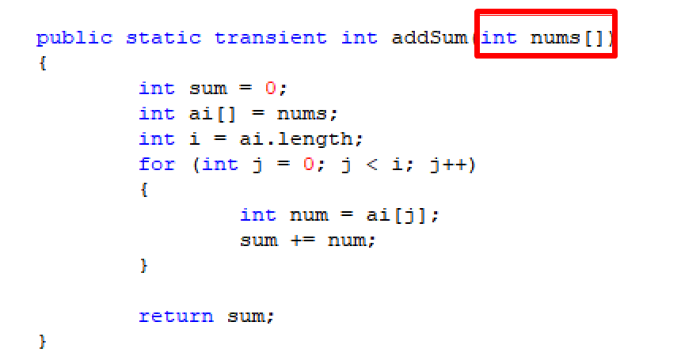
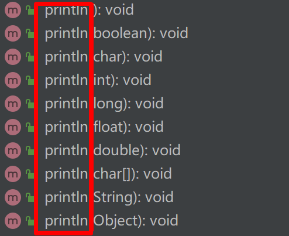
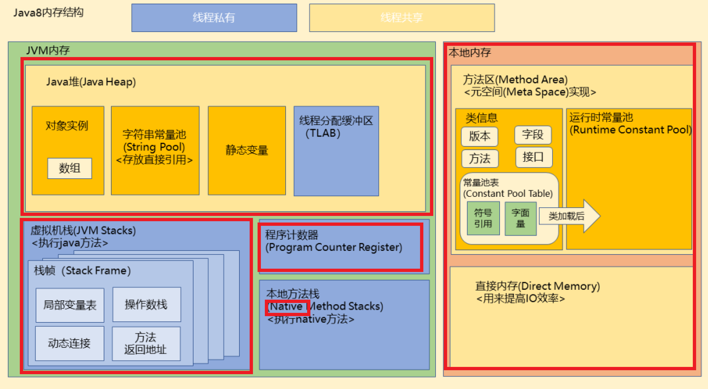
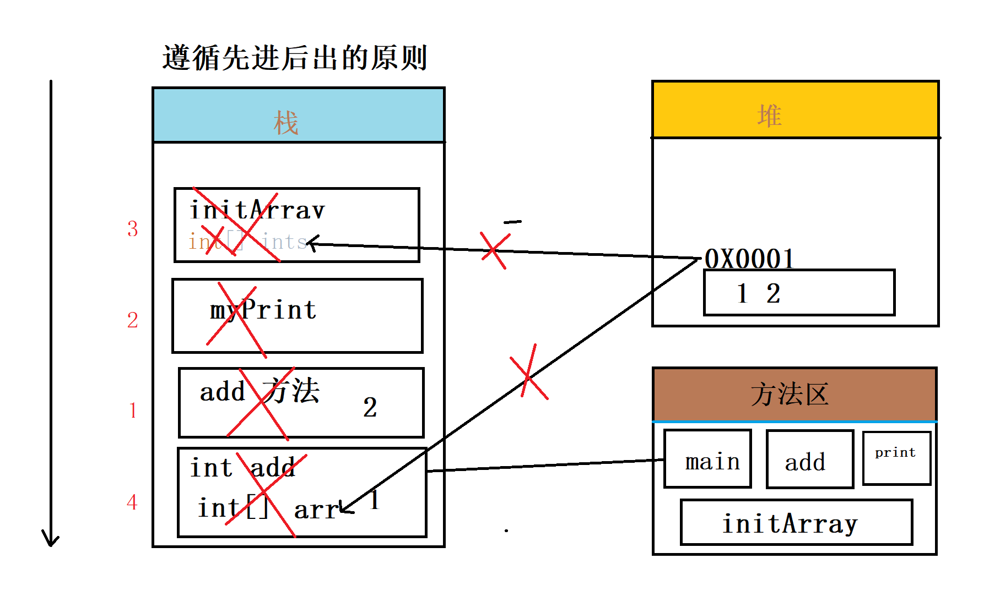
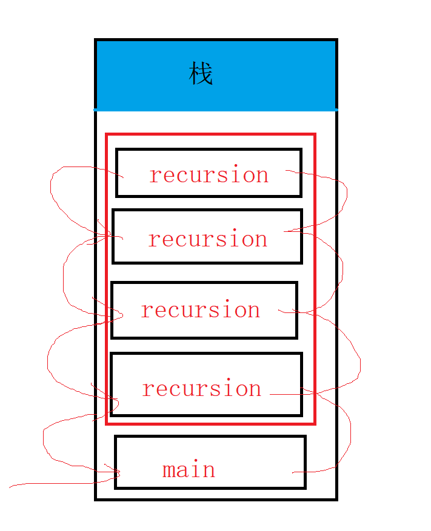

# 方法

1. 生活中的方法：处理某件事或者解决某个问题的办法。

2. java中的方法：用来解决某件事情或者实现某个功能的办法。

   

3. 方法的定义

   ```java
   修饰符 返回值类型 方法名(形式参数){
       方法体
   }
   //实现从老代码迭代成新代码
   //修饰符      方法无返回   方法名   参数列表
   public static void      print(String str) {
           
   }
   ```

4. 带返回类型的方法定义

   ```java
   修饰符 返回值类型 方法名(形式参数){
       方法体
           
       return 返回值类型;
   }
   ```

5. return 的作用：结束当前的方法，可以单独用，还可以带返回类型用

6. **返回类型**：

   - 八大基本数据类型 
   - 引用数据类型
   - void(没有返回)

7. 需求：定义加法计算器，带两个参数的，方法返回类型为 int

   ```java
   public static int add(int num1,int num2){
           int ret = num1 + num2;
           return ret;
   }
   ```

8. 需求：求5个数的和，返回类型 int

   ```java
    public static int addSum(int... nums) {
           int sum = 0;
           for (int num : nums) {
               sum += num;
           }
           return sum;
       }
   ```

9. 注意：方法的可变参数底层实际上就是数组

   

# 方法的重载

1. 需求1.0：

   - 定义一个求浮点型 double 的计算器
   - 定义方法分别去求 float 计算器
   - 定义方法分别去求 short 计算器
   - 定义方法区求 String 字符串的拼接

2. 需求2.0

   - 定义打印 String 类型的字符串方法
   - 定义打印 int 类型的方法

3. 方法的重载：

   - 定义：同一个类里面，方法允许存在一个以上的同名方法，要求参数列表不同
   - 参数列表不同：
     - 1.参数类型不同
     - 2.参数顺序不同
     - 3.参数个数不同
   - 和返回值类型无关

   

# JVM内存模型变化

1. 栈：是线程私有的，生命周期与线程相同，线程之间不共享，里面拥有多个栈帧
   - 局部变量
     - 方法内定义的局部变量
     - 参数列表变量
     - 对象引用（指向对象的引用地址）指向堆里面
   - 栈是一块连续的空间，相对于堆来说，内存较小，运行速度较快，不需要垃圾回收机制
2. 堆：是jvm 内存模型最大的一块，被所有共享，在jvm 启动时所创建。
   - 存放对象实例（new 对象）并且会给初始值
   - 需要垃圾回收机制回收垃圾，
   - 配置大小：-Xmx -Xms
   - 如果堆中的对象没有被栈引用时，会被垃圾回收器不定时回收。
3. **字符串常量池**：存储在类加载完成，经过验证，解析阶段的一些常量字符串。
4. 程序计数器pc:
   - 是一块很小的内存区域，记录当前线程执行的字节码的行号指示器，可以去通过计数器控制，指令，循环，跳转。
   - 线程私有，每条线程都有自己的程序计数器
5. 方法区：
   - 类信息，记录类的字节码信息，常量池（String 和 包装类）
6. GC（垃圾回收器）：不定时的回收垃圾，回收一些没有引用的堆内存的垃圾，不需要程序员手动操作。



# jvm方法执行内存模型变化



# 方法的递归

1. 定义：方法自己调用自己

2. 需求：

   - 不使用递归计算 5 的阶乘

     ```java
     int num = 5;
     int ret = 1;
     for (int i = 0; i < 5; i++) {
         ret *= num--;
     }
     System.out.println(ret);
     ```

   - 使用递归计算5的阶乘

     ```java
     public static int recursion(int num) {
         if (num == 1) {
             return 1;
         }
         int recursion = recursion(num - 1);
         int ret = num * recursion;
         return ret;
     }
     ```

     

