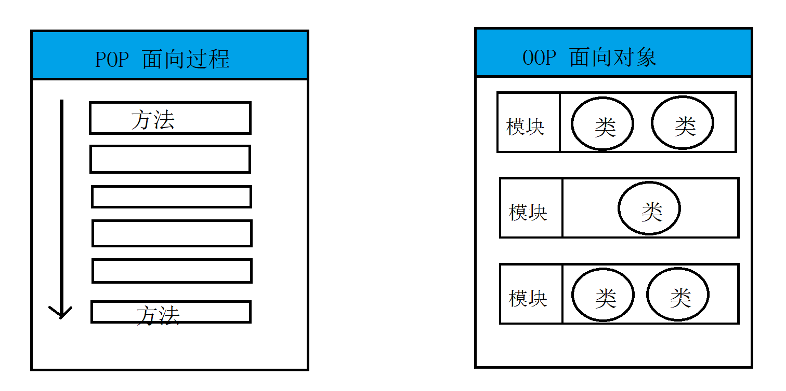
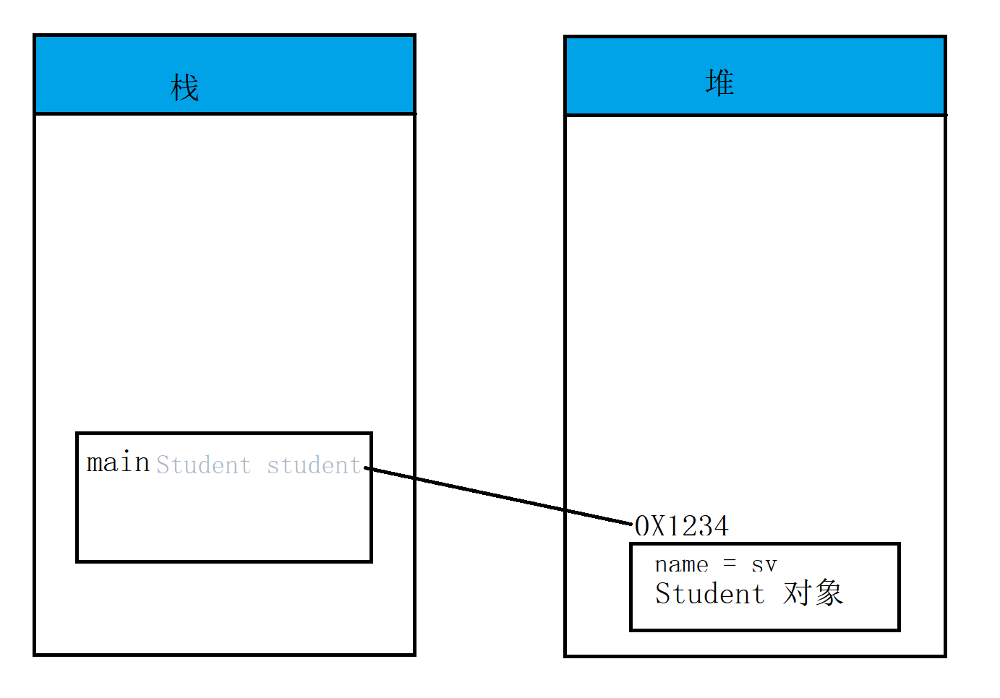

# 软件设计的概况

1. 软件的生命周期
   - 产品提出需求
   - 分析以及规划
   - 软件编码及其调试（自测，联调）
   - 上测试环境，给测试人员测试（提bug）
   - 上 linux 生产服务器（运维人员维护，修改bug，系统的升级迭代）
   - 被弃用
2. 软件设计原则
   - 可重用性（减少重复的代码）
   - 可拓展性
   - 可维护性
   - 高内聚、低耦合（模块之间要相互独立）

# 面向过程

1. 面向过程：（Procedure Oriented Programming）pop是流程性的执行，需要去处理方法与方法之间的关系，或者是方法的调用
2. 存在问题：从上往下设计的方式，分别考虑每个方法干啥，细分很难。
3. 需求：做饭（买菜，做饭，做菜，吃饭，洗碗）

# 面向对象

1. 面向对象：（Object Oriented Programming ）OOP ,站在对象的角度去考虑问题（处理类和类之间的调用和操作，把每一个类，拆分成不同的功能）
2. 面向对象三大特征：
   - 封装：（可以把功能的特征的一些事物封装成一个对象，可以将细节隐藏起来，通过公共方法来调用，暴露功能）
   - 继承：做到代码的复用
   - 多态：把子类赋值给父类对象，调用的时候，还是去调用子类，表现出不同的特征
3. **类：**具有相同特征和行为的事物进行一个抽象。
   - 电脑：cpu、内存、电源、主板
   - 人：名字，身高，体重
4. 对象：是类的实例，类是对象的模板。

面向对象和面向过程的区别：

- 面向过程会更平面化
- 面向对象会更加立体
- 你中有我，我中有你
- 

## 类的定义

1. 成员变量（字段）

2. 方法

3. 定义格式

   ```java
   public class 类名{
   	0-N个字段（成员变量）
       
          
       0-N个方法;
       
   }
   ```


## 对象的创建和使用

1. 创建方式 **类名 类变量名 = new 类名();**

   ```java
   Student stu = new Student();
   ```

2. 给对象成员变量设置值 **类变量名.字段名=值**

   ```java
   student.name="上云";
   ```

3. 获取成员变量的值,**数据类型 变量名 = 类变量名.字段名**

   ```java
   String name = student.name;
   ```

4. 实例方法的调用，**类对象名.方法名**

   ```java
   student.showInfo();
   ```

   

## 构造方法

1. 也叫构造器（构造方法），是用来创建对象的，当你创建对象时，一定执行

2. 构造方法：

   - 也有修饰符
   - 不具备方法的返回值类型
   - 可以带参数
   - 默认的构造方法，里面没有任何内容
   - 构造方法可以重载

3. 构造方法，创建对象时，可以传参

   ```java
   Book book = new Book("E3层");
   ```

4. 注意：不提供构造方法时，默认提供一个不带参数的构造器

## 实例方法

1. 定义方式：

   - 具有修饰类型
   - 有返回值类型
   - 有方法名和参数列表

2. 定义：

   ```
   修饰符 返回值类型 方法名（参数列表）{
   
   }
   ```

3. 调用方式，使用对象调用。

   ```java
   对象变量名.方法名
   ```

4. 空指针异常（没有去创建对象，就是调用对象的属性或者是方法）

   

## 导包

1. 如果存在重名的情况，需要去选择自己的包 alt + enter