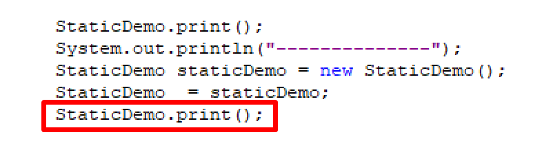
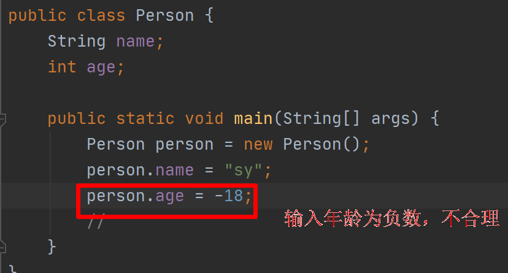

# static 关键字

1. **static**：是一个修饰符，表示静态的，可以用来修饰，方法、字段、代码块、内部类，最优先加载进内存的。

2. 注意：

   - static 关键字，表示该资源属于类（而不是属于类对象）。只要使用 static 修饰的，直接使用类名.来调用，

     不用创建对象

     

   - 在非 static 方法中，可以去访问 static 方法，但是最好用类名.来调用。

   - 在 static 方法中，不能直接访问普通方法

   - 静态代码块优先于一切先执行

     ```java
     static {
         System.out.println("static 修饰的代码块");
     }
     ```

3. 什么时候使用 static 修饰的字段以及方法和代码块

   - 在开发中，写工具类的时候。
   - 资源加载，加载配置文件（mysql jdbc）

# 深入变量

变量的定义语法：

```java
数据类型 变量名 = 值；
```

根据位置不同，分为两大类：

1. 成员变量
   - 类成员变量（类名.字段名调用）
     - 生命周期：从类加载到程序结束
     - 使用 static 修饰的，直接定义到类里面的
   - 实例成员变量
     - 生命周期：从创建对象开始到GC垃圾回收器回收垃圾结束
     - 直接定义到类里面的
2. 局部变量
   - 生命周期：从变量定义开始，到最近的花括号结束}
   - 方法内部的变量
   - 参数列表
   - 代码块里面的变量
3. 什么时候使用成员变量，什么时候使用局部变量？
   - 考虑变量的生存时间（影响内存的开销）
   - 能减少作用域都去减少（减少内存开销）
   - 定义工具类时（static 用起来比较方便）成员变量封装好，利于我们方法使用


# package

1. 类的全限定类名(反射使用)

   - ```
     sy.coder.VariableDemo.VariableDemo
     ```

2. 有的需要导包，有的不需要导这是为啥？
   - **java.lang** java 语言核心包，里面的类直接使用，不需要手动导包
   - java.util java工具包，需要手动导包（Arrays）

# 封装

1. 没有封装会有什么问题

   

2. 是用封装，做到了信息隐藏。

   

3. 什么是封装？
   - 把对象的状态和行为看成了一个统一的整体，放到一个独立的模块中（类）
   - 做到信息隐藏，把不需要外界看到的信息隐藏起来（private进行私有化），**向外提供方法**，保证外界的安全访问。

4. 封装的好处和意义：
   - 提供了代码的复用性（可以减少重复代码）
   - 使用者可以正确操作，方便使用系统功能
   - 把实现细节隐藏起来，提供了安全性

# 访问控制权限修饰符

1. 封装的目的，有些类让另一些类看不到里面再做什么事情，所以提供了访问控制权限修饰符来解决。

2. 访问权限修饰符

   |  修饰符   | 类内部 | 同一个包 | 子类 | 任何地方 |
   | :-------: | :----: | :------: | :--: | :------: |
   |  public   |   √    |    √     |  √   |    √     |
   | protected |   √    |    √     |  √   |          |
   |   缺省    |   √    |    √     |      |          |
   |  private  |   √    |          |      |          |

   

# 封装的实现

1. 规范

   - 遵循 javabean 规范

     - set 后面的单词采用驼峰命名法，并且使用原单词 setAge(...)

     - get getAge();

       ```java
       private int age;
       
       public void setAge(int a){
           age = a;
       }
       
       public int getAge(){
           return age;
       }
       ```

   - 变量：就近原则

   - this 关键字：代表当前对象的引用

   - 需求：建一个学生类，name ,age,address 提供set get 方法。

     ```java
     public class Student {
     
         private String name;
     
         private int age;
     
         private String address;
     
         public Student(){
     
         }
     
         public Student(String name){
             this.name = name;
         }
     
         public void setName(String name){
             this.name = name;
         }
     
         public String getName(){
             return name;
         }
     
         public void setAge(int age){
             this.age = age;
         }
     
         public int getAge(){
             return age;
         }
     
         public void setAddress(String address){
             System.out.println(this);
             this.address = address;
         }
     
         public String getAddress(){
             return address;
         }
     }
     ```

2. 对于私有属性传参

   - 使用 set get
   - 使用构造器

3. 注意：

   - static 静态的不能使用this 关键字，默认get 如果你不写 this,底层也会给我们加上 this
   - this 关键字也可以再构造器里面使用