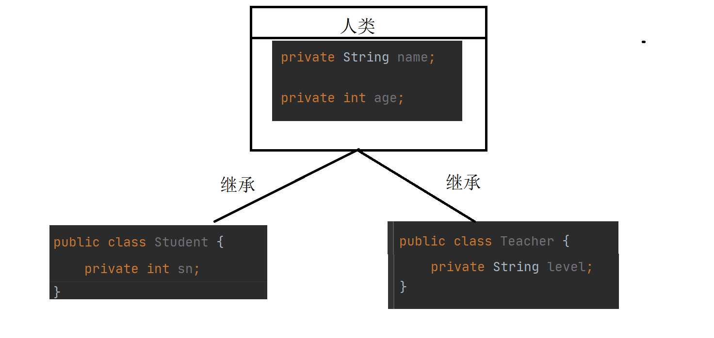
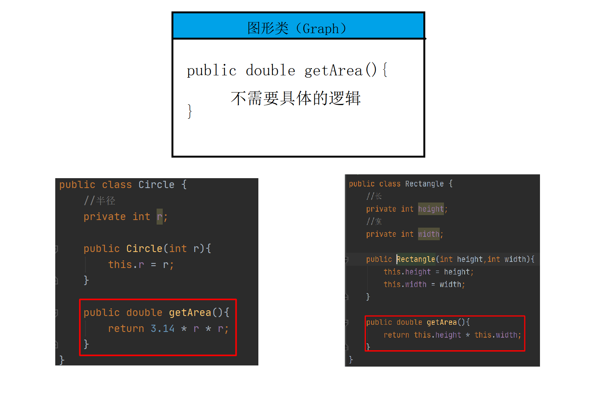
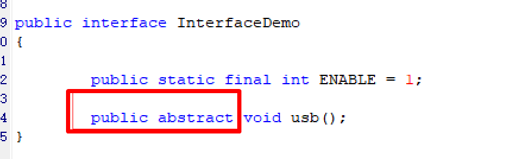
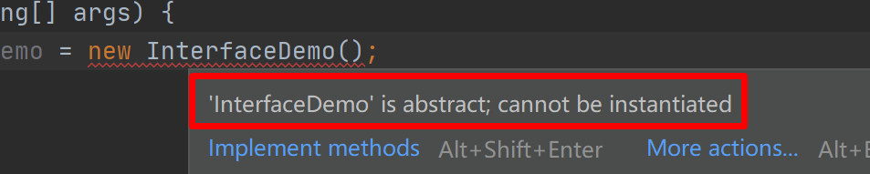
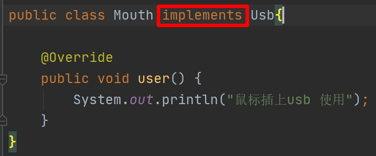
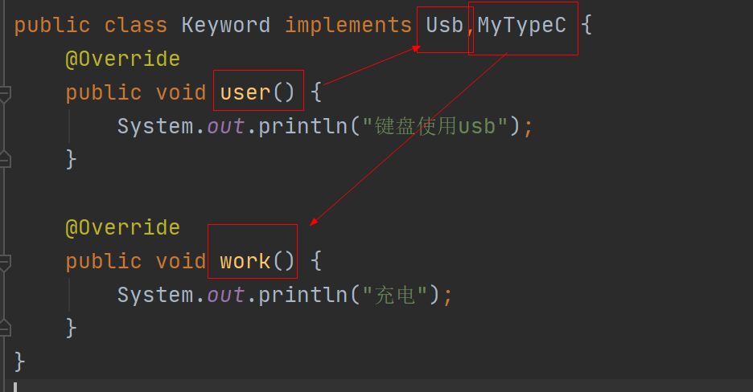
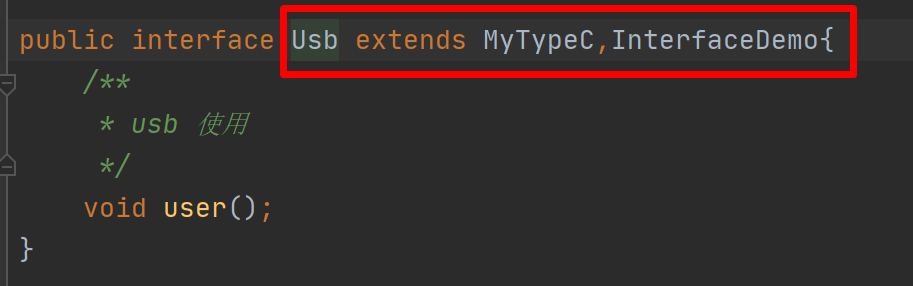

# 引出继承

父类：存储共性（状态，行为）

子类：存放自己的特性

继承的作用：代码复用



# 继承思想

定义：基于某个父类对其进行拓展，定义新的子类，子类可以继承父类原来的属性和行为，并且可以增加父类没有的特性，或者覆盖父类中的某些特性

继承关系：is a 用是造句

继承的基础语法：

```java
使用 extends 关键字
    
public class 子类类名 extends 父类类名{
    写自己的特征
}
```

注意：

- java 只支持单继承，允许多重继承（一个类只能有一个直接父类，但是可以有多个间接父类）
- 任何类都是 Object 的子类


创建对象时，构造方法如何执行

- 先执行父类构造器（先执行父类静态代码块，再执行子类静态代码块）
- 子类构造器
- set get 方法
- 创建对象时，创建的是谁，打印 this 对象就是谁（多态）

## 重写

1. 重写：当父类特征不能满足子类特征的时候，可以对父类的方法进行重写
2. 要求：
   - 子类的访问修饰符 >= 父类本身
   - 父类不能使用 private 修饰
   - 方法返回类型，子类 <= 父类

## 重写和重载的区别

1. 没有任何关系，只不过因为名字看起来相同，所以就拿来对比

2. 重载：发生在同一个类中，方法名相同，参数列表不同，和方法的返回类型无关

3. 重写：override

4. 重载：overload

   - 重载：解决了一个类中，相同功能方法名不同的问题
   - 重写：解决子类继承父类，父类方法满足不了子类要求时，需要在子类里面重写

   

# 抽象类

1. 需求：求圆（Circle）,矩形（Rectangle）的面积
2. 使用 abstract 关键字修饰，并且没有方法体
   - 必须使用 abstract 关键字修饰，方法没有方法体，留给子类去实现/重写
   - 不能使用 private 以及 static  和 final
   - 抽象方法必须定义到抽象类中或者接口
3. 使用 abstract 修饰的类特点：
   - 不能实例化
   - 抽象类可以有普通的方法
   - 抽象类构造器不能够私有化
   - 

# 接口

1. 什么是接口

   - 硬件接口：两个设备之间的连接方式，包含数据传输协议
     - type-c，usb，耳机接口
   - 软件接口：程序代码，是一种规范

   统一接口后的意义：根据规范设计产品，可以做到适配性。

   - 买鼠标不会去关心是哪家厂商的，是什么接口

# JAVA 接口

1. 定义：使用 interface 关键字

   ```java
   //使用 interface 代替传统的 class
   public interface 类名{
       //都是抽象方法
       void usb();
       //定义常量
       public static final int EANBLE = 1;
   }
   ```

2. 注意：

   - 接口里面只能去定义抽象方法

   - 抽象方法默认提供了 public abstract 修饰符

     

   - 接口不能实例化（和抽象类一样）

     

3. 接口怎么去实现

   - 使用 implements 关键字

     

4. 接口支持多实现，分别把每个接口的抽象方法都去实现了。

   

   

5. 接口的多继承

   

## 抽象类和接口怎么选择

1. 都可以使用
   - 如果你不需要具体的实现时，就用接口。
   - 如果说你除了定义规范还有一定的功能，你就用抽象类

# 模板方法设计模式

1. 需求：统计不同操作的时间用时。
   - 使用 String 拼接一万次
   - 使用 int 累加 一万次