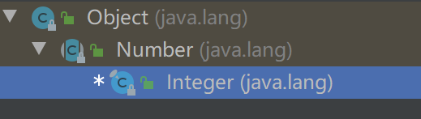
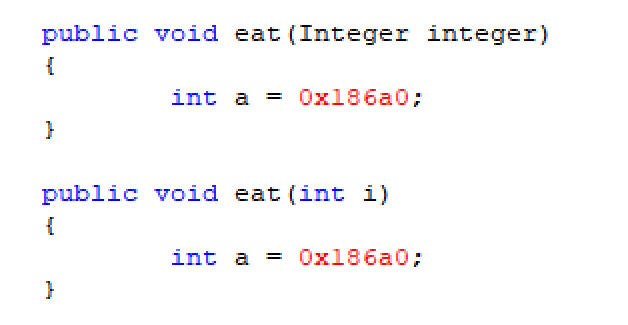

# JAVA 编码规范

1. 编码对于我们程序员来说，特点重要，原因如下：
   1. 一个软件的生命周期，90%时间都是在维护系统
   2. 良好的编码习惯可以改善代码的可读性
2. 编码规范：
   - 起名：做到见名知意，遵循标识符规范
     - 不能使用拼音，采用驼峰命名法（StudentInfo）
   - 边写代码边测试，打印中间变量进行观察，确保程序正确性
   - 基本规范：
     - 包名：域名倒写，工具类 utils , 控制层 controller
     - 类名：一般使用名词，并且首字母大写，不要使用jdk 内置名字
     - 接口名：单词前面习惯加字母 i (IUser)
     - 方法名：（动词），eat()，saveUser();
     - 变量名：首字母小写，多个单词用驼峰，studentName
     - 常量名：final 修饰的，多个单词全部大写，用_隔开，MAX_VALUE,MIN_VALUE

# 基本类型的包装类型

1. 问题：
   - 一切皆对象？int age = 18;
   - 给你一个数，8888，转换成二进制，算法非常难
   - double 类型，默认值 0.0，缺考怎么去表示？考试0分的时候怎么去表示？
2. 基本数据类型，缺少对象，jdk 提供了包装类型来解决如上问题。


## Number 抽象类的学习

```java
//获取 int 类型的值
public abstract int intValue();

//获取 long 类型的值
public abstract long longValue();

public abstract float floatValue();

public abstract double doubleValue();

public byte byteValue() {
    return (byte)intValue();
}

public short shortValue() {
    return (short)intValue();
}
```


## Integer （int）

1. integer 继承结构

   

2. 构造器学习

   ```java
   public Integer(String s) throws NumberFormatException {
       this.value = parseInt(s, 10);
   }
   //将字符串解析成 int 类型
   public static int parseInt(String s) throws NumberFormatException {
       return parseInt(s,10);
   }
   
   //将字符串解析成 Integer 类型的数
   public static Integer valueOf(String s) throws NumberFormatException {
       return Integer.valueOf(parseInt(s, 10));
   }
   
   //将Integer 对象转换成 int 数
   public int intValue() {
       return value;
   }
   ```

   

2. 自动装箱和拆箱(语法糖)

   ```java
   //自动装箱
   Integer integer3 = 10;
   Integer integer3 = Integer.valueOf(10);
   //自动拆箱
   int intValue = integer3;
   int intValue = integer3.intValue();
   ```

3. 整数类型做了一个缓存处理

   ```java
   private static class IntegerCache {
       //缓存了 [-128,127]
   }
   ```

## String Integer int 相互转换

1. String 转 Integer

   ```java
   Integer.valueOf()
   
   new Integer();
   ```

2. String 转 int

   ```java
   Integer.valueOf();
   ```

3. Integer 转 int

   ```java
   integer 对象.intValue();
   ```

   

## 拓展内容（面试内容，面试前再回头来听）

1. 缓存设计的优点

   - 节约空间开销
   - 超过缓存范围才重新分配空间

2. Integer 类型和 int 类型不是同一个类型

   - 通过方法的重载证明

3. 两个方法分别定义 int a = 100000;当int 类型的值，超过 short 的最大值时，存储到常量池里面

   

# 包装类型对应

| 基本类型 | 默认值 | 包装类型  | 包装类型默认值 |
| :------: | :----: | :-------: | :------------: |
|   int    |   0    |  Integer  |      null      |
|   long   |   0    |   Long    |      null      |
| boolean  | false  |  Boolean  |      null      |
|   byte   |   0    |   Byte    |      null      |
|  short   |   0    |   Short   |      null      |
|  float   |  0.0   |   Float   |      null      |
|  double  |  0.0   |  Double   |      null      |
|   char   |   ''   | Character |      null      |

1. 注意：开发过程中，建议使用包装类型

# 大数据运算

1. BigInteger : java 开发中，我们的数超过了 long 类型，使用它

   ```java
   public BigInteger(String val) {
       this(val, 10);
   }
   ```

   - 四则运算：

   ```java
   public BigInteger add(BigInteger val) {}
   
   public BigInteger subtract(BigInteger val) {}
   
   public BigInteger multiply(BigInteger val) {}
   
   public BigInteger divide(BigInteger val) {}
   ```

2. BigDecimal：具有精度运算的

   - 需求：
     - 打印 0.09 + 0.01
     - 打印 1 - 0.34
     - 打印 1.403 / 100
   - 注意：做金钱运算使用 BigDecimal
   - 里面有加减乘除的方法

# 随机数 Random

1. 需求：随机生成 1- 100 之间的数，生成10次

   ```java
   Random random = new Random();
   
   for (int i = 0; i < 10; i++) {
       int j = random.nextInt(100);
       System.out.println(j);
   }
   ```

2. 需求：随机生成 100-200 之间的随机数，生成10次

   ```java
   //多思考
   Random random = new Random();
   
   for (int i = 0; i < 10; i++) {
       int j = random.nextInt(100) + 100;
       System.out.println(j);
   }
   ```

   

# Math 类（）数学类

1. Math 类包含了数学的常用方法：
   - 平方
   - 三角函数
   - 平方根
   - 指数
   - 绝对值

# Arrays 工具类

1. 自己写过二分查找法