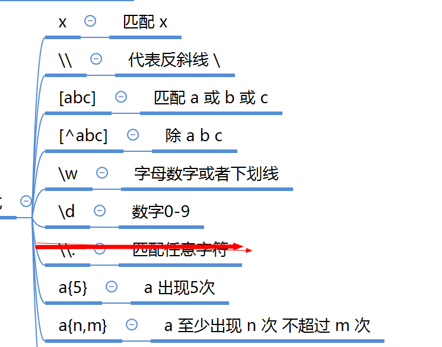
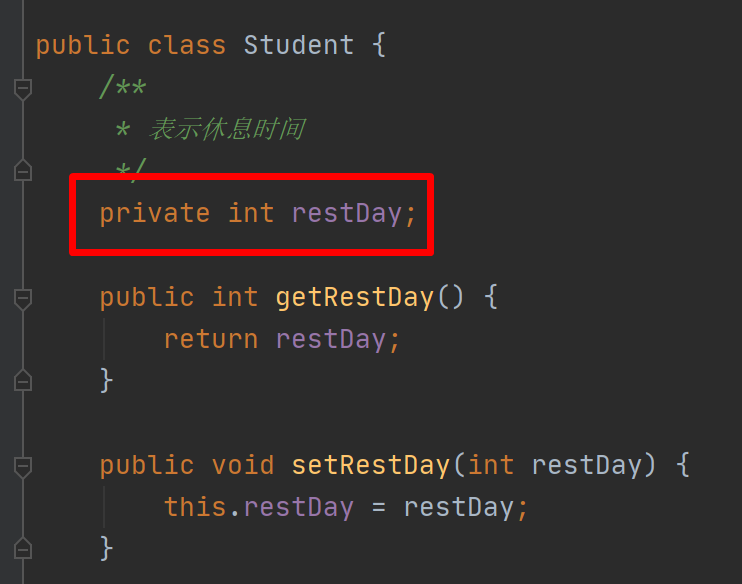
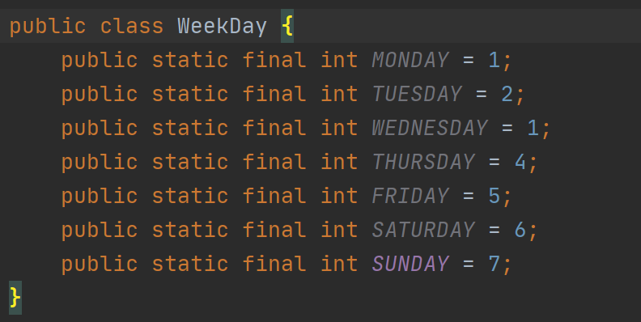
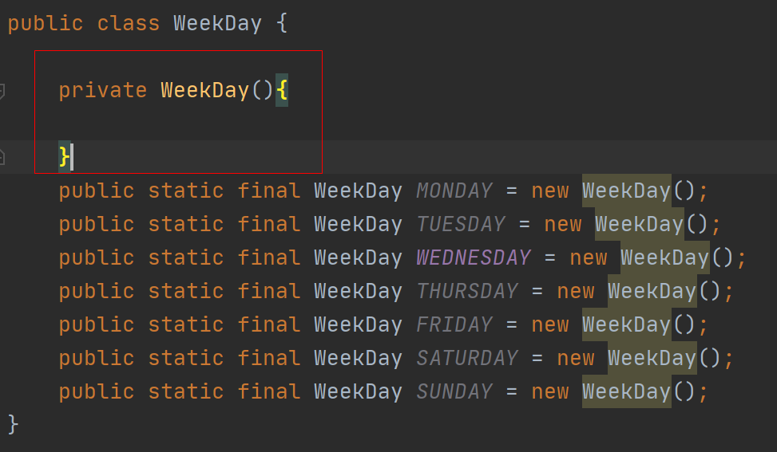
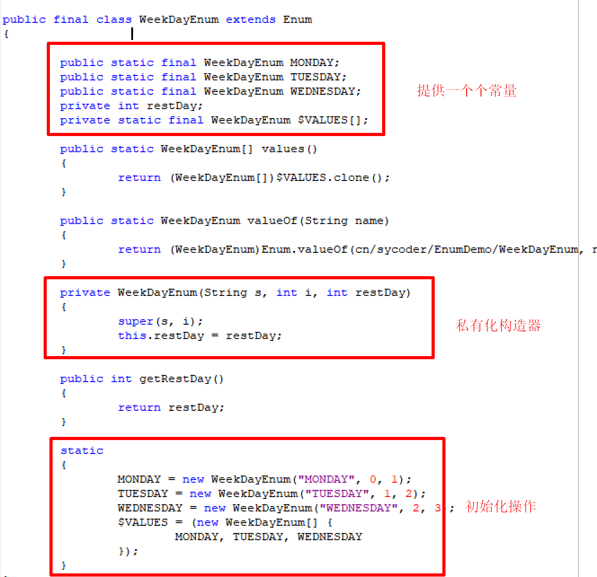

# 正则表达式

1. 正则表达式：使用字符串来定义匹配规则（regex）

2. 正则表达式的匹配练习：

   

1. 注意：正则不用手动去写，也不用去记，了解一下就行了。
2. 去网站生成正则表达式就行


# 日期处理

## Date

```java
//创建当前日期对象
public Date() {
    this(System.currentTimeMillis());
}

//打印符合我们本地人观看的时间日期
@Deprecated
public String toLocaleString() {
    DateFormat formatter = DateFormat.getDateTimeInstance();
    return formatter.format(this);
}
```

## SimpleDateFormat -->DateFormat


把日期变成字符串

```java
 public final String format(Date date)
```

把字符串变成日期

```java
 public Date parse(String source) 
```

最常用的日期格式

- yyyy-MM-dd
- yyyy-MM-dd HH:mm:ss


| 字母 |                             含义                             |                             示例                             |
| :--: | :----------------------------------------------------------: | :----------------------------------------------------------: |
|  y   |       年份。一般用 yy 表示两位年份，yyyy 表示 4 位年份       |  使用 yy 表示的年扮，如 11；  使用 yyyy 表示的年份，如 2011  |
|  M   | 月份。一般用 MM 表示月份，如果使用 MMM，则会  根据语言环境显示不同语言的月份 | 使用 MM 表示的月份，如 05；  使用 MMM 表示月份，在 Locale.CHINA  语言环境下，如“十月”；在 Locale.US  语言环境下，如 Oct |
|  d   |               月份中的天数。一般用 dd 表示天数               |                  使用 dd 表示的天数，如 10                   |
|  D   |       年份中的天数。表示当天是当年的第几天， 用 D 表示       |              使用 D 表示的年份中的天数，如 295               |
|  E   | 星期几。用 E 表示，会根据语言环境的不同， 显示不  同语言的星期几 | 使用 E 表示星期几，在 Locale.CHINA 语  言环境下，如“星期四”；在 Locale.US 语  言环境下，如 Thu |
|  H   |         一天中的小时数（0~23)。一般用 HH 表示小时数          |                 使用 HH 表示的小时数，如 18                  |
|  h   |        一天中的小时数（1~12)。一般使用 hh 表示小时数         | 使用 hh 表示的小时数，如 10 (注意 10 有  可能是 10 点，也可能是 22 点） |
|  m   |                分钟数。一般使用 mm 表示分钟数                |                 使用 mm 表示的分钟数，如 29                  |
|  s   |                  秒数。一般使用 ss 表示秒数                  |                  使用 ss 表示的秒数，如 38                   |
|  S   |               毫秒数。一般使用 SSS 表示毫秒数                |                使用 SSS 表示的毫秒数，如 156                 |

## Calendar 日历类

1. 获取日历对象

   ```java
   public static Calendar getInstance()
   ```

2. 获取当前时间

   ```java
   public final Date getTime() {
       return new Date(getTimeInMillis());
   }
   ```

   

# 工具类的设计

1. 日期工具类的设计
   - 需求：建立一个员工类， Employee, entry 入职时间，birthday 生日，创建员工管理类 EmployeeManager input 录入数据
   - 发现如果不使用工具类，代码太臃肿了。所以需要抽工具类
2. 数组工具类自行设计


# 枚举

1. 需求：定义一个学生类，定义一个成员变量 restDay（表示学习哪天休息）

2. 问题如下

   - 非法数据设置、

     

   - 解决办法1：使用指定的单独管日期的类 WeekDay,并且不能够修改内容，使用7个常量来表示，能保证选择数据安全性，但是还是吧不能保证数据安全



​						解决办法2：私有化构造器，使用对象来代替常量



1. 枚举：

   ```java
   [public] enum 枚举名称{
       常量1，常量2；
   }
   ```

2. 特点

   - 构造器私有化

   - 里面是一个个常量

   - 枚举里面可以提供带参数构造器

   - 可以提供 set get方法

   - 可以定义普通方法

     

# 单例设计模式

1. 单例模式：只能创建出一个对象，不能创建多个，提供方法去获取需要的对象。