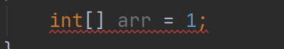
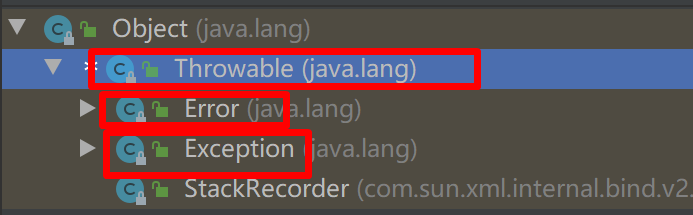

# 没有异常处理时如何处理异常

1. 什么是异常：非正常的，不正常的。

2. 程序中：代码出现错误，程序会终止运行。异常指的不是语法错误，语法错误，编译不通过，不能产生字节码文件，根本不能运行

   

3. 异常是衡量语言成熟的标准之一，java C++都支持异常处理机制。

4. 上学迟到的异常：

   ```java
   public class Sleep {
       public static final int OK = 1;//准时起床
       public static final int NO_OK = 0;//没起来
       public int asleep(int num) {
           if(num == Sleep.OK){
               System.out.println("准时起床");
               return OK;
           }else{
               System.out.println("起晚了翘课");
               return NO_OK;
           }
       }
   }
   
   public class Student {
       public static final int LATE = 0;//代表迟到或者翘课
       public static final int IN_TIME = 1;//准时上课
       public Sleep sleep;
       public Student(Sleep sleep){
           this.sleep = sleep;
       }
       public int gotoStudy(int num){
           if (sleep.asleep(num) == Sleep.OK) {
               System.out.println("准时上课");
               return Student.IN_TIME;
           }else{
               System.out.println("翘课");
               return Student.LATE;
           }
       }
   }
   
   Sleep sleep = new Sleep();
   Student student = new Student(sleep);
   
   int i = student.gotoStudy(0);
   if(i == Student.IN_TIME){
       System.out.println("准时上学");
   }else{
       System.out.println("翘课");
   }
   ```

5. 没有异常机制存在问题：

   - 使用方法的返回值来表示异常，无法穷尽所有情况来表示
   - 异常代码和正常流程混在一起了。代码更加臃肿，增加了程序的复杂性，可读性也变低了。
   - 随着系统规模扩大，维护性变低了。

# 异常机制

1. 解决上述问题，把不同的异常类型描述成不同的类（异常类），变得更加的灵活，自己不想处理的可以交给调用者处理

2. 异常继承结构图

   

   - Error 错误：指JVM 相关的不可修复的错误，如：内存溢出，JVM错误等。常见的Error
     - StackOverflowError 栈异常，使用递归没有出口的时候
     - OutOfMemoryError 内存不够
   - Exception: 常见异常
     - NullportException 空指针异常
     - ArrayIndexOutofBundsException 数组索引越界异常

3. 查看异常信息（可以定义异常的行数的，大胆的去解决不要害怕）

# 异常处理

如果出现异常，程序是不能继续往下执行的，这个时候需要我们程序员手动处理异常。

- 如果该方法不处理：通过方法声明抛出，由调用该方法的调用者来处理（throws）
- 在方法中使用 try{}catch(){} 的语句进行处理

语法格式：

1. throws 关键字

   - 声明：把问题标识出来，报告给调用者，由调用者处理（有甩锅的感觉）

   - 在参数列表上 throws + 具体的异常类型

   - 用在方法上

   - 格式

     ```java
     public static Date getDateByString(String str) throws ParseException {
         DateFormat format = new SimpleDateFormat("yyyy-MM-dd");
         Date parse = format.parse(str);
         return parse;
     }
     ```

2. throw 关键字

   - 用来抛出一个指定类型的异常

   - 创建一个异常对象 throws 异常对象；

   - 用在方法内部

   - 格式

     ```java
     public static int divide(int a, int b) {
         if (b == 0) {
             throw new ArithmeticException("除数不能为0");
         }
         return a / b;
     }
     ```

3. try...catch

   - 用来处理异常

   - 定义格式

     ```java
     try{
         可能出现异常的代码
     }catch(异常的类型 变量){
         异常执行代码
     }
     
     try{
         int divide = divide(1, 0);
     }catch(ArithmeticException e){
     //            e.printStackTrace();
         System.out.println("我们的除法计算器出现异常了");
     }
     System.out.println("欢迎下次光临");
     ```

4. try...catch...finally

   ```java
   try{
       可能出现异常的代码
   }catch(异常的类型 变量){
       异常执行代码
   }finally{
       无论程序怎么执行，都会执行到这里
   }
   
   finally 代码块永远会执行
   ```

5. 什么时候使用 throws？throw?try...catch

   - throws:当前方法不需要去处理，只需要提供异常信息，给调用者处理即可
   - throw:方法会出现异常时，需要提醒调用者
   - try...catch：具体需要处理的时候

6. Exception 和 RuntimeException 的区别

   - **Exception** 是受检查异常，必须处理或者throws 出去
   - **RuntimeException** 运行时异常，运行的时候才去检查

7. 异常对象常用方法：
   - getMessage() 获取具体的异常原因
   - printStackTrace()//打印具体的错误


# final、finalize、finally有什么区别（面试题）

1. final:表示最终的，不可修改的。
   - final int MAX = 10; 常量
   - final class Student 不可以继承
   - final 去修饰方法，不可以被重写
2. finalize:Object 的一个方法，提供给GC垃圾回收器使用的。
3. finally:异常处理的代码块，最终都要执行


# 重写复习

- 发生到子类和父类之间
- 方法签名必须相同（方法名和形式参数）
- 子类返回类型必须和父类一致或者比它小
- 子类的修饰符大于等于父类
- 建议：子类抛出的异常小于等于父类


# 自定义异常

1. 现有的异常不能满足我的要求，需要自己去定义：

   - IndexOutofBundsException 索引越界异常

     ```java
     public class IndexOutOfBoundsException extends RuntimeException {
         public IndexOutOfBoundsException() {
             super();
         }
         public IndexOutOfBoundsException(String s) {
             super(s);
         }
     }
     
     ```

   - NullpointerException 空指针异常

     ```java
     public class NullPointerException extends RuntimeException {
       
         public NullPointerException() {
             super();
         }
     
         public NullPointerException(String s) {
             super(s);
         }
     }
     ```

2. 自定义异常

   - 语法

     ```java
     public class 自定义异常类 extends 异常类{
         //定义无参数构造器
         public 自定义异常类() {
         	super();
         }
     	//带一个String类型参数的构造器
         public 自定义异常类(String s) {
             super(s);
         }
     }
     ```

   - 例子

     ```java
     public class MyNullPointerException extends Exception {
     
         public MyNullPointerException(){
             super();
         }
     
         public MyNullPointerException(String s){
             super(s);
         }
     }
     ```

异常在开发中的使用：

- 项目中会做统一异常处理，状态码返回 200 400 404 500
- 普通的正常异常的处理