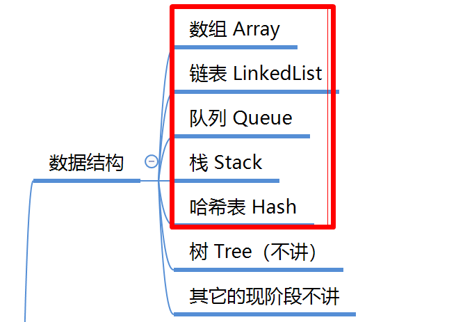
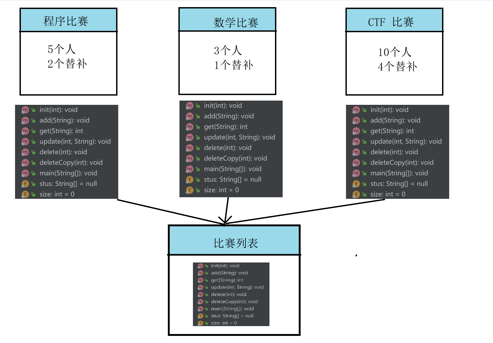
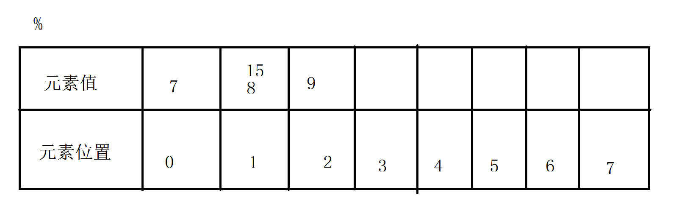

# 数据结构

1. 什么是数据结构：是用来做计算存储，组织数据（插入数据，更新数据，删除数据，查询数据）的一种方式，是相互之间，存在一种或者多种特定关系的数据结合。数据结构需要高效的算法和索引技术。

2. 常见的数据结构：

   

- 意义：带来更高效的存储和运行效率
- 要求：高效的检索算法和索引技术
- 作用（模拟：存储学生的信息）
  - 保存学生信息
  - 修改学生信息
  - 删除学生信息
  - 查询学生信息
  - 查询多个学生信息
- ArrayList LinkedList HashMap (高度封装，别人给我们提供好的)

# 引出ArrayList

1. 需求：加入你是大学生程序竞赛的导师（5个参赛名额，1-2个替补）
   - 准备一个数组（5）
   - 安排5个学生去比赛
   - 查询某一个同学是几号比赛位
   - 替补替换2号同学
   - 3号同学作弊，禁止3号同学参赛（不能安排替补上场）
   - 打印最后比赛参赛选手的名称

2. 新需求

   - 带队3个人参加数学比赛
   - 带队10个人参加 ctf 比赛

   

## 分析 ArrayList 性能

1. 大O表示法（BigO）:用来描述时间的复杂度，专门用来衡量计算机性能
2. 分析 ArrayList 性能
   - 新增操作：
     - 把数据添加到最后一个元素，至少操作一次
     - 如果把数据放到数组的第一个位置，现在有N个元素，此时需要操作N次（整体后移）
     - 平均：O(（N+1）/2 )  O(N)
   - 删除操作：
     - 如果是最后一个元素，操作一次
     - 如果删除第一个元素，操作N次
     - 平均 O((N+1)/2) O(N)
   - 修改操作：
     - 操作一次
   - 查询操作：
     - 根据索引去查，也是操作1次
     - 根据元素来查，1-N次之间 O(（N+1）/2 )  O(N)
3. 基于数组结够，**做查询和修改非常快，但是做删除和新增会慢一点**

# 链表 LinkedList

1. 链表分为：

   - 单向链表

     增加和删除

   - **双向链表**

     - 往前添加
     - 往后添加
     - 删除

   ## 分析 LinkedList 性能

   - 增加：
     - 直接从头尾增加，操作1次
   - 删除
     - 如果删除头尾元素，操作1次
     - 删除中间元素，（1+N）/2
   - 查询
     - 查询头尾 1次
     - 查询中间 （1+N）/2
   - 修改
     - 头尾1次
     - 中间 （1+N）/2

   基于数组和链表的对比：

   - ArrayList:查询更改较快，新增和删除较慢
   - LinkedList:查询，更改较慢，新增和删除较快

# 队列

队列是一种特殊的线性表，特殊之处在于只允许在表的前端或者后端操作

单向队列（Queue）：先进先出（FIFO），只能从队尾插入数据，从头部删除

双向队列（Deque）：可以从头尾什么都可以操作。

# 栈

1. 栈（stack）:受限制的线性表，先进后出（FILO）
2. 被限制只允许从表的一段进行插入和删除运算，这一端称为栈顶，另一端就称为栈底

# 哈希表：Hash

1. 一般数组中，通过索引操作的，索引和我们元素之间是不存在确定关系。查找值直接查索引就行
2. hashtable:元素值和我们的hashtable 是存在对应关系的

3. 需求：不适用任何的集合，也不使用数据库，添加学生信息（id name）,做到快速查询
   - 插入查询特别快
   - 元素位置--->哈希码--->链表