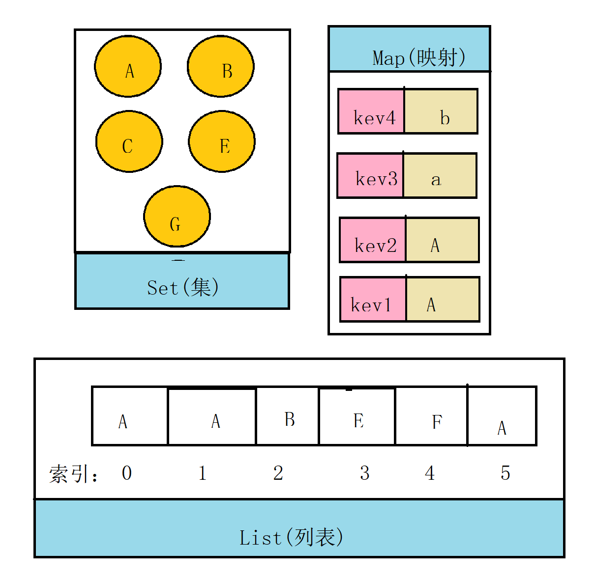
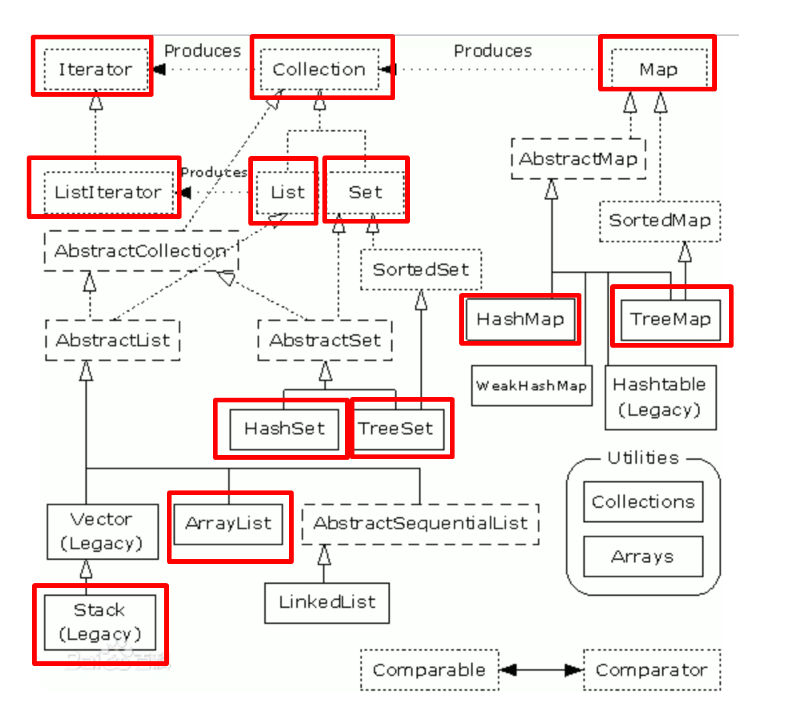
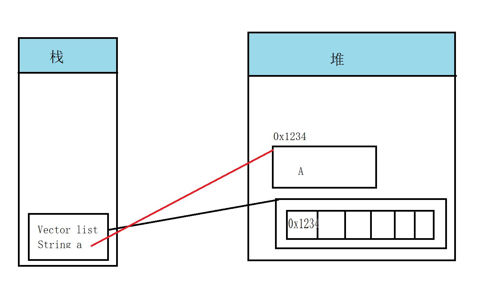

# 集合概述

1. 集合框架（java.util）的由来：容器类（集合类）可以存储多个数据，数组明明可以存储多个数据，为啥还要定义容器类？

   - 数组弊端：
     - 长度一但固定就不可变
     - 很多地方需要操作数组的（增删改查）都需要去编写对应的方法（代码重复了--->封装）
     - 每个人定义各自的方法，可能存在别人找不到 这种情况，实现也容易存在bug

2. 什么是集合框架：容器类确实很好用，集合框架框架是为了提供一些规范和标准，任何实现类都需要包含对外的接口，接口的实现，对集合内部的算法（底层都是一种数据结构）

3. 定义集合框架的目的：提供代码复用（封装的思想），**让使用者专注于业务开发，而不是数据结构和算法。**

4. 常见集合类：

   - List(列表)：集合中对象按照索引位置排序，允许元素重复。
   - Set(集)：集合中的元素不按特定方式排序，不允许元素重复。
   - Map(映射)：集合中的元素（key-value）,不允许key 重复，值可以重复。

   



# Collection 常用方法

1. 接口定义的常用方法规范

   ```java
   //集合容量大小 
   int size();
   //判断集合是否为空
   boolean isEmpty();
   //包含是否有某一个元素
   boolean contains(Object o);
   //迭代器
   Iterator<E> iterator();
   //转换成数组
   Object[] toArray();
   //添加元素的
   boolean add(E e);
   //删除元素
   boolean remove(Object o);
   //判断集合是否包含另一个集合
   boolean containsAll(Collection<?> c);
   //添加一个集合
   boolean addAll(Collection<? extends E> c);
   //清空
   void clear();
   //获取hashcode
   int hashCode();
   ```

2. 通用迭代

   ```java
   Iterator it = 集合对象.iterator();
   while(it.hasNext()){
       Object ele = it.next();
   }
   
   //迭代器接口
   //判断是否有下一个元素
   boolean hasNext();
   //获取下一个元素
   E next();
   ```

   

# List 接口

1. List 接口规范：

   ```java
   //根据索引获取元素值 
   E get(int index);
   //设置某一个索引位置元素值
   E set(int index, E element);
   //删除某一个索引位置的值
    E remove(int index);
   //截取
   List<E> subList(int fromIndex, int toIndex);
   ```

## Vector 实现类

1. 看源码学习

   ```java
   public class Vector<E> extends AbstractList<E> implements List<E>{
          //元素数组
         protected Object[] elementData;
         //元素个数
         protected int elementCount;
         //扩容容量
         protected int capacityIncrement;
       
       public Vector(int initialCapacity, int capacityIncrement) {
           this.elementData = new Object[initialCapacity];
           this.capacityIncrement = capacityIncrement;
       }
       
        public Vector(int initialCapacity) {
           this(initialCapacity, 0);
        }
       
       public Vector() {
           this(10);
       }
       
        public synchronized void addElement(E obj) {
           modCount++;
           ensureCapacityHelper(elementCount + 1);
           elementData[elementCount++] = obj;
       }
       //扩容逻辑
        private void grow(int minCapacity) {
           // overflow-conscious code
           int oldCapacity = elementData.length;
            //如果你传进来扩容容量，新容量=老容量+传进来的扩容容量否则2倍老容量
           int newCapacity = oldCapacity + ((capacityIncrement > 0) ?
                                            capacityIncrement : oldCapacity);
           if (newCapacity - minCapacity < 0)
               newCapacity = minCapacity;
           if (newCapacity - MAX_ARRAY_SIZE > 0)
               //给int类型的最大值
               newCapacity = hugeCapacity(minCapacity);
            //数组的拷贝
           elementData = Arrays.copyOf(elementData, newCapacity);
       }
       
       
   }
   ```

2. Vector 总结

   - 底层使用 Object[] 数组（调用不带参数构造器时，默认长度为10，若不传扩容参数，扩容2倍）
   - toString 方法已经重写并且可以直接打印出数组的样子
   - **增查**删改
   - 常用方法
     - add(E obj)
     - addElement(E obj)
   - 查询
     - size() 查长度
     - get(int index) 查具体索引位置的元素值
     - isEmpty() 判断集合为空
   - 删除
     - **remove(int index)删除具体索引位置的元素**
     - remove("A") 删除指定元素
     - removeLast() 循环，设置 null ,等待gc 回收
   - 修改
     - set(int index,E obj);修改某一个索引位置元素值



## Stack 栈

栈：是数据结构，First In Last Out

栈结构生活中的体现：

- QQ消息：AB两个人先后发送消息，最后发送的是最新的。

栈：底层可以用数组，或者链表

```java
//添加元素
public E push(E item) {
        addElement(item);
        return item;
}
//取元素并且删除
 public synchronized E pop() {
    E       obj;
    int     len = size();
    obj = peek();
    removeElementAt(len - 1);
    return obj;
}

//查看栈顶元素
public synchronized E peek() {
    int     len = size();
    if (len == 0)
        throw new EmptyStackException();
    return elementAt(len - 1);
}
```

- **建议：建议使用ArrayDeque(方法会更加友好)**


## ArrayList

ArrayList 是用来取代 Vector.两者底层原理和算法，一模一样。

区别：

- Vector:所有的方法都是用 synchronized 修饰符，表示线程安全的，性能低，适用于多线程环境
- **ArrayList**:线程不安全，性能高，即使在多线程环境下也是用它（Collections.synchronizedList(list)）
- ArrayList 底层扩容是1.5倍，Vector 是两倍
- 底层构造器ArrayList 优化了，默认创建对象的时候是给一个空数组，第一次调用add 方法时，采取重新初始化数组（创建对象时，如果不存任何值，也浪费了堆空间）

## LinkedList

1. LinkedList:是一个双向链表，双向队列（单向队列）list 的实现类。

   |    Queue 方法     |     DQueue 方法     |        LinkedList         |
   | :---------------: | :-----------------: | :-----------------------: |
   | boolean add(E e); | void addFirst(E e); |    public E getFirst()    |
   |    E remove();    | void addLast(E e);  |    public E getLast()     |
   |     E poll();     |  E removeFirst();   | public void addFirst(E e) |
   |   E element();    |   E removeLast();   | public void addLast(E e)  |
   |     E peek();     |   E pollFirst();    |                           |
   |                   |    E pollLast();    |                           |
   |                   |    E getFirst();    |                           |
   |                   |  boolean add(E e);  |                           |
   |                   |   void push(E e);   |                           |
   |                   |      E pop();       |                           |

2. **面试题：请编写一个双向链表**

3. 注意：

   - LinkedList 是非线程安全的，保证线程安全，使用Collections 线程安全方法
   - 擅长操作头和尾，大多数你以后要用的方法， addFirst addLast removeFirst
   - 链表不存在索引，但是调用get(index) 是因为底层提供了 ListItr 这个内部类 提供了一个int 的索引
   - 擅长保存和删除操作


## List 的总结

1. 根据 Vector ArrayList LinkedList 类的所有特点进行一个抽象，定义一个规范
2. 特点：
   - 允许元素重复
   - 会记录添加顺序
   - 具有很多共同方法


## 实现类的选用

1. ArrayList 取代 Vector 直接使用
2. LinkedList:
   - 数组结构的算法：插入和删除速度慢，查询和更改较快
   - 链表结构的算法：插入和删除速度快，查询和更改较慢

# 泛型

1. 为啥使用泛型？

   - 存在一定问题：
     - 取集合元素时，取出来的是Object 类型，需要强制类型转换才能使用
     - 添加元素时候，缺乏规范，导致可能需要使用时，会出现类型转换异常
   - **设计原则，不要写重复的代码，能抽就抽**

2. 泛型：是一种数据规范和约束，提供**编译时期的安全检查机制**，底层给我们做强制类型转换

3. 如何使用泛型？

   - 常见的字母

     - T type(类型，使用到类上面)
     - K V （key value）
     - E element(元素)

   - 使用

     - 使用到类或者接口上

       ```java
       public class User<T> {
           T obj;
       }
       
       //多个的方法
       public class User<T,E,k> {
           T obj;
           E ele;
           k value;
       }
       ```

     - 接口

       ```java
       public interface Usb<T> {
           void user(T t);
       }
       ```

     - 方法

       ```java
       public static <T> T print(T t){
           return t;
       }
       ```

     - 泛型的继承

       ```java
       public class Mouth<T,T1> implements Usb<T,T1>{
           @Override
           public void user(T t, T1 t1) {
           }
       }
       
       public class Keyword<T> implements Usb<T,String>{
           @Override
           public void user(T t, String s) {
           }
       }
       ```

       

