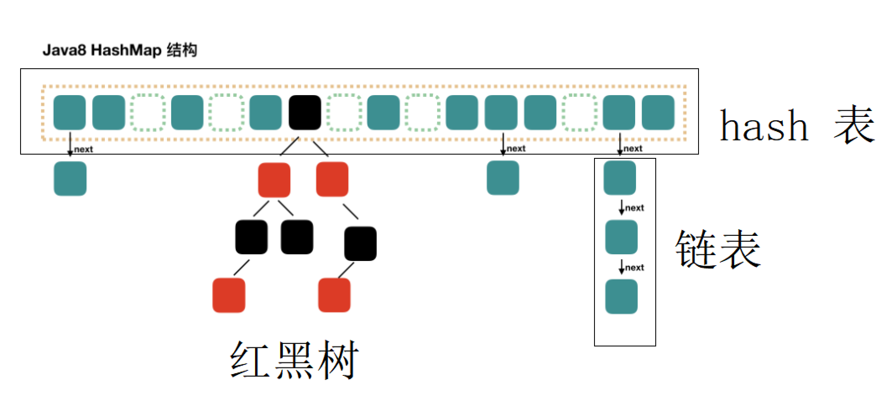
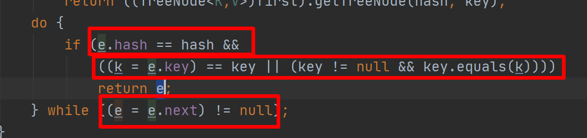
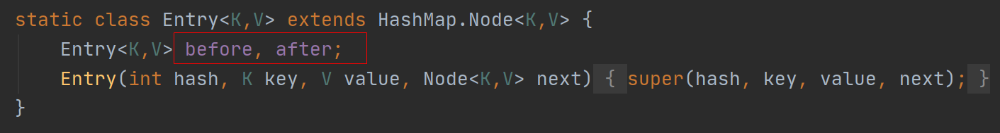
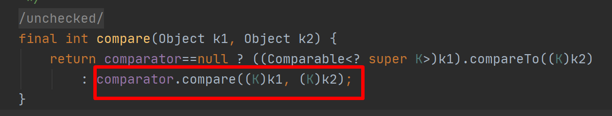

# Map 接口

1. map 概述：key--->value 的映射关系，是以键值对的方式存储

2. Map:是一种两个集合之间的一个映射关系，Map 并没有继承 Collection 接口

   - key 是不可以重复
   - value 是可以重复的

3. Map 最常用的实现类:

   - **HashTable**
   - **HashMap**
   - **LinkedHashMap**
   - Properties
   - ConcurrentHashMap

4. map 常用的方法

   ```java
   int size();
   //判断某一个key 是否存在
   boolean containsKey(Object key);
   //获取元素值
   V get(Object key);
   //设置值
   V put(K key, V value);
   //删除某一个key 的值
   V remove(Object key);
   //获取所有的key
    Set<K> keySet();
   //获取所有的value
   Collection<V> values();
   //获取键值对对象
   Set<Map.Entry<K, V>> entrySet();
   ```

   

## HashMap



1. put 方法的实现原理

   ```java
   public V put(K key, V value) {
       return putVal(hash(key), key, value, false, true);
   }
   
   hash(key);
   
   Node<K,V> 单向的
       
   TreeNode<K,V>
   ```

2. get 方法原理

   ```java
   hash(key)//先找hash表中的位置
   //判断是treeNode，如果是使用红黑树算法寻找value,不是使用链表遍历
   treeNode 算法，使用hash 往左节点或者右节点直接找。
       
   遍历链表，判断hash 的同时，去判断 key 值
   
   ```

   


1. 面试题：java7 个 hava8 hashMap 的区别

2. 使用

   - key --- String

   - value 无所谓

   - **注意，存String 类型无所谓，存对象类型，需要重写equals 方法和 hashCode();**

     ```java
     Map<Student,String> mapStu = new HashMap<>();
     mapStu.put(new Student(10),"sy");
     mapStu.put(new Student(12),"zs");
     mapStu.put(new Student(13),"ls");
     mapStu.put(new Student(10),"zz");
     
     Set<Map.Entry<Student, String>> entries = mapStu.entrySet();
     System.out.println(entries);
     for (Map.Entry<Student, String> entry : entries) {
         System.out.println(entry.getKey());
         System.out.println("-----");
         System.out.println(entry.getValue());
     }
     ```

   - 嵌套使用

## LinkedHashMap



1. 记录添加顺序，key 不允许重复，判断 key 是否重复和 HashMap 标准一致

## HashTable

1. HashTable:和HashMap 几乎一致，它是线程安全的，被HashMap 所替代了。采用hash表算法，所有的方法synchronized修饰符修饰，性能低一点。

   

### Properties

用来加载资源文件

```java
public synchronized void load(InputStream inStream) throws IOException {
    load0(new LineReader(inStream));
}
```

## TreeMap

1. 采用红黑树算法，里面的key 会按照自然顺序（不自己指定排序规则）自动排序，或者定制排序，可以不能重复，k**ey 判断重复的标准，Comparator compare 的返回值判断**

   - 返回值 = 0
   - 返回值 > 0 升序 ASC
   - 返回值 < 0 降序 DESC

2. 需求：计算一个字符串中字符出现的次数 "fwihfiwehfihewifhiaufiuhailfawigfuauekgfweufuiwegfieuw",并按照 a b c 的方式排序;

   ```java
   String str = "fwihfiwehfihewifhiaufiuhailfawigfuauekgfweufuiwegfieuw";
   char[] chars = str.toCharArray();
   Map<Character,Integer> map = new TreeMap<>();
   for (char aChar : chars) {
       //如果从map 里面找不到，说明没值
       if(map.get(aChar) == null ){
           map.put(aChar,1);
       }else{
           Integer integer = map.get(aChar);
           map.put(aChar,++integer);
       }
   }
   
   System.out.println(map);
   ```

   

3. 排序源码

   