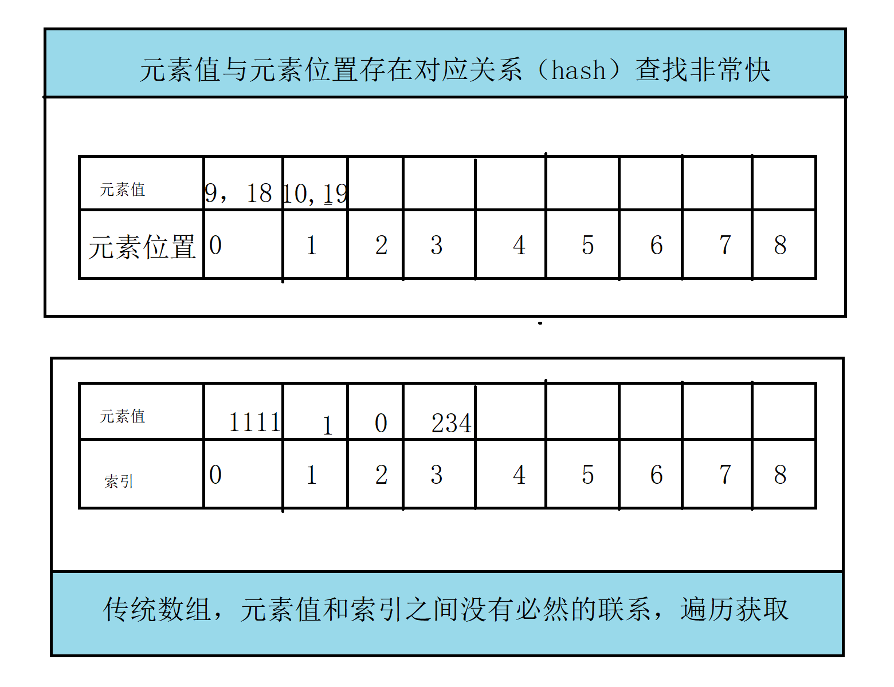
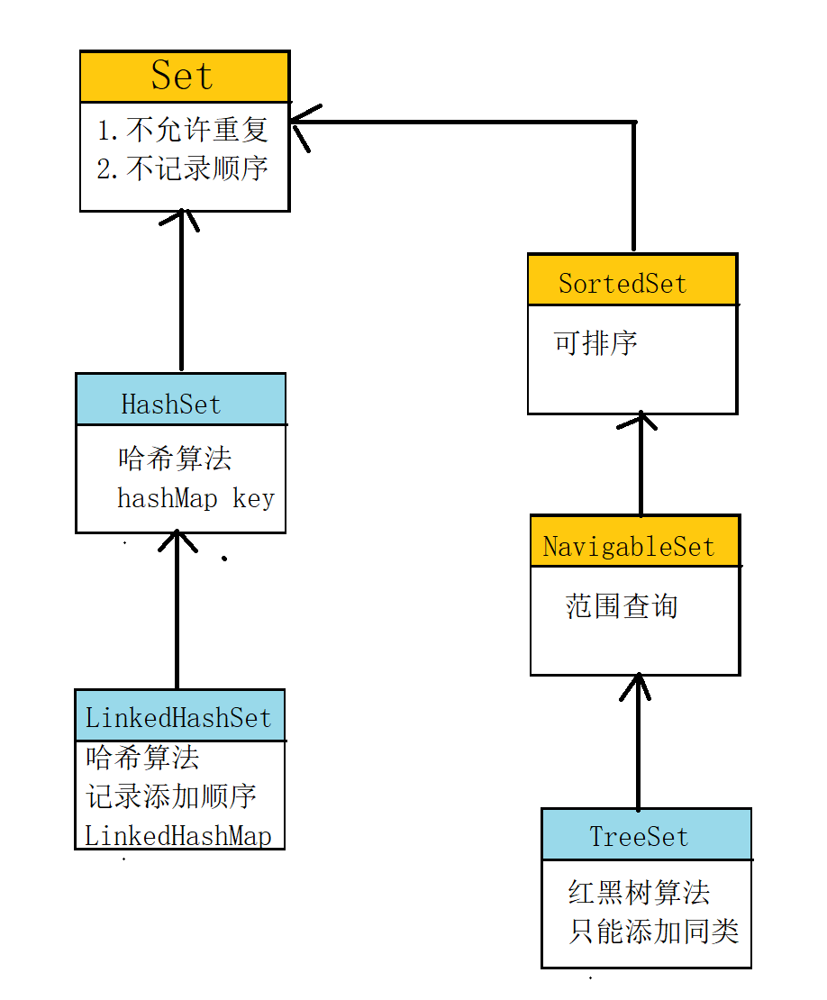
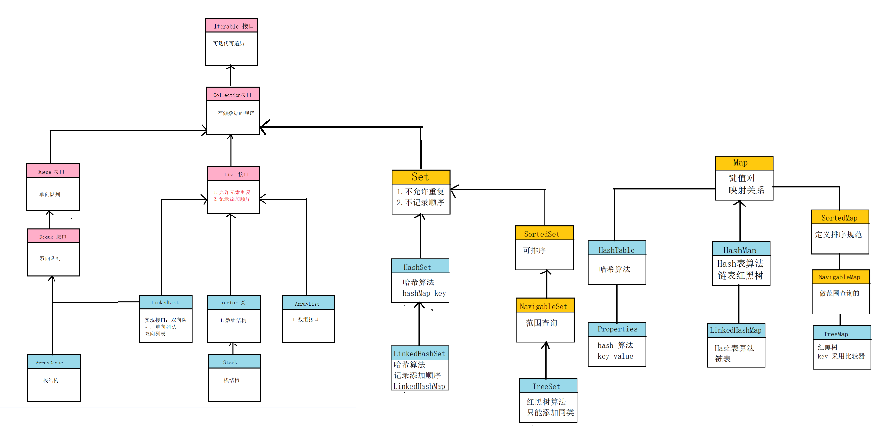

# Set 接口

1. Set 接口是 Collection 的子接口，相当于数学上的集合

2. Set 存储元素的特点：

   - **不允许元素重复**，尝试添加相同元素，会返回false
   - **不会记录元素的先后添加顺序**
   - 判断两个元素对象是否相等用的是equals 方法

3. hash 表与 数组对比

   

## HashSet

1. HashSet 是 Set 最常用的接口，底层使用 Hash（散列） 算法，查询速度和插入速度较快。

2. HashSet 判断两个对象是否相等，equasl 比较。返回 true 表示相等。

3. 对象的 HashCode 值决定了在hash 表中的位置。

   - 判断添加对象和集合元素对象HashCode值。
     - 不等：直接将新添加对象存储导对应位置
     - 相等：再继续判断新对象和集合中对象的具体值，equals 方法判断
       - HashCode 相同，equals true ，则是同一个对象，则不保存hashtable 中
       - HashCode 相同，equasl false,存储到同槽的链表上。

4. HashSet 基于 HashMap 实现的

   ```java
   //直接使用HashMap写好的代码，体现了封装的原则，减少重复代码
   private transient HashMap<E,Object> map;
   //map.put value 永远设置同一块空间 new Object 的静态常量
   public boolean add(E e) {
       return map.put(e, PRESENT)==null;
   }
   //得到 HashMap 的 key
   public Iterator<E> iterator() {
       return map.keySet().iterator();
   }
   ```

5. **注意：记得重写 equals 和 hashCode 方法**


## LinkedHashSet

1. 底层使用哈希表算法，和链表算法，

   - 哈希表用来保证唯一性，HashSet 里面是不记录添加先后顺序的。
   - **链表，来记录元素的添加顺序**

2. 底层基于LinkedHashMap 实现

   ```java
   public LinkedHashSet() {
       super(16, .75f, true);
   }
   
   HashSet(int initialCapacity, float loadFactor, boolean dummy) {
       map = new LinkedHashMap<>(initialCapacity, loadFactor);
   }
   ```

   

## TreeSet

1. TreeSet:底层使用红黑树算法，会对存储的元素做自然排序（小-大）

2. 注意：使用TreeSet 时，必须使用同一种数据类型。因为需要比较，否则就会报类型转换异常

   - **底层肯定实现了Comparable 接口**
   - 比较结果 
     - 大于0
     - 等于0 则说明是同一个对象
     - 小于0

3. 底层都是基于 TreeMap 实现的

   ```java
   //底层使用 treeMap 
   public TreeSet() {
       this(new TreeMap<E,Object>());
   }
   //可以传一个自定义比较器
   public TreeSet(Comparator<? super E> comparator) {
       this(new TreeMap<>(comparator));
   }
   ```

   



# Collections集合工具类

1. 常用方法

   ```java
   //获取线程安全的集合
    Collections.synchronizedList(new ArrayList());
   //获取线程安全的集合
   Collections.synchronizedCollection(Collection);
   //排序，好挺常用
   public static <T extends Comparable<? super T>> void sort(List<T> list) {
       list.sort(null);
   }
   ```

2. 其它常用

   ```java
   public static final List EMPTY_LIST = new EmptyList<>();
   public static final Map EMPTY_MAP = new EmptyMap<>();
   public static final Set EMPTY_SET = new EmptySet<>();
   ```

   

# 集合类整体总结



是否记录添加顺序的总结如下：

|   数据类型    | 是否记录添加顺序 | 是否添加就排序 |        底层算法        |
| :-----------: | :--------------: | :------------: | :--------------------: |
|   arrayList   |       true       |     false      |          数组          |
|  linkedList   |       true       |     false      |          链表          |
|    hashSet    |      false       |     false      |    哈希算法，红黑树    |
| linkedHashSet |       true       |     fasle      | 哈希算法，链表，红黑树 |
|    treeSet    |      false       |      true      |         红黑树         |
|    hashMap    |      false       |     false      |    哈希算法，红黑树    |
| linkedHashMap |       true       |     false      | 哈希算法，链表，红黑树 |
|    treeMap    |      false       |      true      |         红黑树         |

