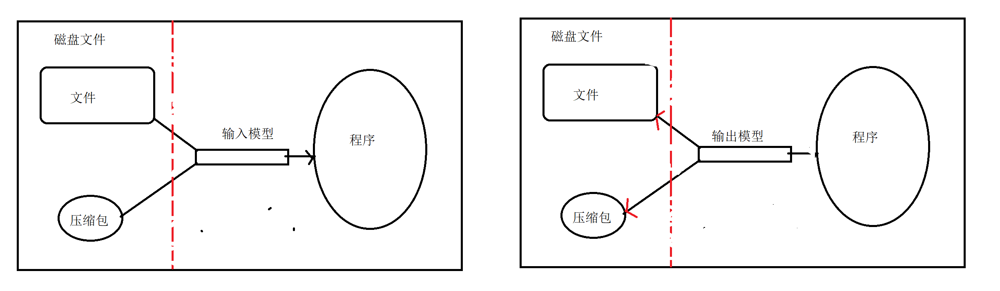
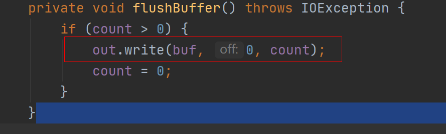

# IO概述

1. io:输入和输出
   - 输入设备：
     - 键盘，鼠标，麦克风
   - 输出设备
     - 显示器，打印机，音响
2. 为什么程序需要io
   - 做数据存储持久化。
3. io流的分类(java.io 包下面的)
   - 按流向（输入和输出流）
   - 按数据单位（字节流字符流）
   - 四大基本流
     - 字节输入流
     - 字节输出流
     - 字符输入流
     - 字符输出流
   - **不管你是什么流，都需要关闭资源**如果不关闭资源，磁盘文件会被占用，不能删除也不能修改



注意：操作IO流

- 输入输出的目标搞明白，程序写出去，输出，程序读进来，输入
  - 输入
    - read()
  - 输出
    - write()

# 文件流

## 字节流

1. 字节流：

   - FileInputStream 文件输入流

     - 需求：读 my.txt 的文件内容出来

       ```java
       常用方法
       public FileInputStream(String name) throws FileNotFoundException {
           this(name != null ? new File(name) : null);
       }
       //通过文件获取输入流对象
       public FileInputStream(File file)
       //通过 byte[] 数组读
       public int read(byte b[]) throws IOException {
           return readBytes(b, 0, b.length);
       }
       //关闭资源的方式
       public void close() ；
       ```

       ```java
         //获取文件对象
               File file = new File("D:\\javase\\homework\\practice\\day20\\my.txt");
               //获取文件输入流对象
               FileInputStream in = null;
               try {
                   in = new FileInputStream(file);
                   int length = -1;
       //        while ((length = in.read()) != -1){
       //            System.out.println(length);
       //        }
                   byte[] bytes = new byte[1024];
                   while ((length = in.read(bytes)) != -1){
                       String s = new String(bytes);
                       System.out.println(s);
                   }
       
               } catch (Exception e) {
                   e.printStackTrace();
               }finally {
                   try {
                       in.close();
                   } catch (IOException e) {
                       e.printStackTrace();
                   }
               }
       ```

       

   - FileOutputStream 文件输出流

     - 需求：把 sy666 写进刚才读的文件里面

       ```java
       //append 表示是否追加
       public FileOutputStream(String name, boolean append)
       //关闭资源
       public void close()
       //写
        public void write(byte b[])
       ```

       ```java
       //获取文件对象
               File file = new File("D:\\javase\\homework\\practice\\day20\\my.txt");
               FileOutputStream out = null;
               try {
                    out = new FileOutputStream(file,true);
                   String sy = "sy666";
                   byte[] bytes = sy.getBytes();
                   out.write(bytes);
               } catch (Exception e) {
                   e.printStackTrace();
               }finally {
                   if(out != null){
                       try {
                           out.close();
                       } catch (IOException e) {
                           e.printStackTrace();
                       }
                   }
               }
       ```

   - 需求：将 sy.txt 文件中的内容，拷贝成一个新文件 new.txt

     ```java
     FileInputStream in = null;
             FileOutputStream out = null;
             try {
                 in = new FileInputStream("D:\\javase\\homework\\practice\\day20\\my.txt");
                 out = new FileOutputStream("D:\\javase\\homework\\practice\\day20\\new.txt");
                 byte[] buffer = new byte[10];
                 int length = -1;
                 // in.read 读数据到 buffer
                 while ((length = in.read(buffer)) != -1){
                     out.write(buffer);//把 buffer 中的数据写出去
                 }
     
     
             } catch (Exception e) {
                 e.printStackTrace();
             } finally {
                 try {
                     if (in != null) {
                         in.close();
                     }
                     if (out != null) {
                         out.close();
                     }
                 } catch (IOException e) {
                     e.printStackTrace();
                 }
     
             }
     ```

     

## 字符流

1. FileReader 输入

   ```java
   FileReader reader = null;
   try {
       reader = new FileReader("D:\\javase\\homework\\practice\\day20\\my.txt");
       char[] buffer = new char[1024];
       int length = -1;
       while ((length = reader.read(buffer) ) != -1){
           String s = String.valueOf(buffer);
           System.out.println(s);
       }
   } catch (Exception e) {
       e.printStackTrace();
   }finally {
       reader.close();
   }
   ```

   

2. FileWriter 输出

   ```java
   FileWriter fileWriter = new FileWriter("D:\\javase\\homework\\practice\\day20\\my.txt", true);
   fileWriter.write("你好");
   fileWriter.write("上云");
   //关闭资源
   fileWriter.close();
   ```

   

- 字节流与字符流的选择
  - 二进制文件，图片，音频，视频必须使用字节流
  - 文本文件（txt）使用字符流
  - **不清楚类型，用字节流**

- flush(刷新操作)
  - 计算机直接访问磁盘文件的时候，比操作内存慢，**设置一个缓冲区**，写的时候直接先写到内存，达到特定值再写到磁盘
  - 使用缓冲区意义：
    - 提高cpu的使用率
    - 回滚写入的数据
  - **操作系统使用 -1 代表磁盘文件结尾的标志**
  - IO 是最影响程序性能的，缓冲区设置容量的整数倍，可以去有效的提高 io 性能 1024.



try catch 资源自动释放

- 语法

  ```java
  try(需要关闭资源的文件写到这里){
      
  }catch(){
      
  }
  
  public static void copyFile1(String srcFilePath, String destFilePath) {
  
          try (FileInputStream in = new FileInputStream(srcFilePath);
               FileOutputStream out = new FileOutputStream(destFilePath);
               
               ) {
              byte[] buffer = new byte[10];
              int length = -1;
              // in.read 读数据到 buffer
              while ((length = in.read(buffer)) != -1) {
                  out.write(buffer);//把 buffer 中的数据写出去
              }
  
          } catch (Exception e) {
              e.printStackTrace();
          }
  
  
      }
  ```

  

## 缓冲流

1. 缓冲流：其实就是个包装流，目的是起缓冲的作用，提升io 性能
2. 字节缓冲流
   - BufferedInputStream 字节缓冲输入流
   - BufferedOutputStream 字节缓冲输出流
3. 字符缓冲流
   - BufferedReader 字符缓冲输入流
   - BufferedWriter 字符缓冲输出流


# 使用缓冲流与不使用缓冲流性能的对比

1. 使用单字节拷贝方式

   - 使用传统字节流

     ```java
     public static void copy(String srcPath, String destPath) throws IOException {
             long begin = System.currentTimeMillis();
             FileInputStream in = new FileInputStream(srcPath);
             FileOutputStream out = new FileOutputStream(destPath);
             int length = -1;
             while ((length = in.read()) != -1) {
                 out.write(length);
             }
             in.close();
             out.close();
             long end = System.currentTimeMillis();
             System.out.println("拷贝耗时：" + (end - begin));
         }
     ```

   - 使用 Buffered 缓冲流

     ```java
      public static void copyBuffer(String srcPath, String destPath) throws IOException {
             long begin = System.currentTimeMillis();
             FileInputStream in = new FileInputStream(srcPath);
             FileOutputStream out = new FileOutputStream(destPath);
             BufferedInputStream bufferedIn = new BufferedInputStream(in);
             BufferedOutputStream bufferedOut = new BufferedOutputStream(out);
     
             int length = -1;
             while ((length = bufferedIn.read()) != -1){
                 bufferedOut.write(length);
             }
             bufferedIn.close();
             bufferedOut.close();
             in.close();
             out.close();
             long end = System.currentTimeMillis();
             System.out.println("buffered 拷贝耗时：" + (end - begin));
         }
     ```

2. 读和写外面再加buffer

   - 使用传统字节流

     ```JAVA
     long begin = System.currentTimeMillis();
     FileInputStream in = new FileInputStream(srcPath);
     FileOutputStream out = new FileOutputStream(destPath);
     int length = -1;
     byte[] buffered = new byte[10];
     while ((length = in.read(buffered)) != -1) {
         out.write(buffered,0,length);
     }
     in.close();
     out.close();
     long end = System.currentTimeMillis();
     System.out.println("copyBufferedBuffered拷贝耗时：" + (end - begin));
     ```

   - 使用缓冲流

     ```java
     public static void copyBufferBuffered(String srcPath, String destPath) throws IOException {
             long begin = System.currentTimeMillis();
             FileInputStream in = new FileInputStream(srcPath);
             FileOutputStream out = new FileOutputStream(destPath);
             BufferedInputStream bufferedIn = new BufferedInputStream(in);
             BufferedOutputStream bufferedOut = new BufferedOutputStream(out);
             byte[] buffer = new byte[10];
             int length = -1;
             while ((length = bufferedIn.read(buffer)) != -1){
                 bufferedOut.write(buffer,0,length);
             }
             bufferedIn.close();
             bufferedOut.close();
             in.close();
             out.close();
             long end = System.currentTimeMillis();
             System.out.println("buffered buffer 拷贝耗时：" + (end - begin));
         }
     ```

   - **总结：使用缓冲流真的快**

