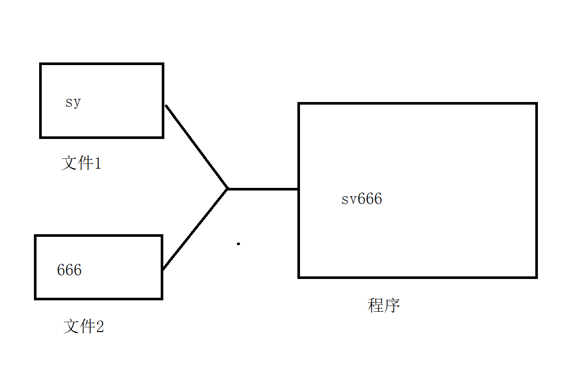

# 字符编码

1. 字符编码的发展流程：

   - 一开始的时候只能存储一个字节，只能认识数字还可以去识别（a-z A-z）ASCII 美国标准信息交换码
   - 随着计算机的普及，很多国家都把自己的字符引入了计算机（汉字）一个字节存储范围太小，用两个字节来存储汉字，使用GB2312 编码 ---GBK（2字节）
   - 中国人肯定使用汉字，但是把汉字给其它国家的使用，其它国家不认识，**显示？乱码**需要统一的编码来管理，Unicode 编码(2字节)

2. 常见的字符集：

   - ASCII：占一个字节，只能够包含128符号，不能表示汉字
   - ISO-8859-1(lanin-1) : 占一个字节，收录西欧语言，不能表示汉字
   - ANSI：占两个字节，可以表达汉字（GB2312,GBK）
   - **UTF-8**:是一种针对 Unicode 的可变长度的字符编码，又称万国码。互联网工程小组，要求所有的互联网协议都必须支持UTF-8

3. 字符的编码以及解码（保证必须使用相同的编码）

   - 编码：把字符串转换成byte 数组
   - 解码：把byte 数组转换成字符串

4. 实操：

   ```java
   String str = "上云";
   //将字符串变成一个byte 数组，编码
   byte[] bytes = str.getBytes("utf-8");
   System.out.println(Arrays.toString(bytes));
   //        String csn = Charset.defaultCharset().name();
   //        System.out.println(csn);
   
   //解码操作
   String s = new String(bytes,"ISO-8859-1");
   System.out.println(s);
   
   //编码
   byte[] bytes1 = s.getBytes("ISO-8859-1");
   System.out.println(Arrays.toString(bytes1));
   String s1 = new String(bytes1, "UTF-8");
   System.out.println(s1);
   
   ```

   


# 转换流

1. 转换流：把字节流转换成字符流
   - InputStreamReader
   - OutputStreamWriter

# 合并流

1. 合并流（SequenceInputStream）：把多个输入流合并成一个流对象

   

# 对象流

1. 序列化以及反序列化

   - 序列化（写）：把内存中的java对象数据，存储到磁盘中去，或者给其它的网络节点使用
   - 反序列化（读）：把磁盘文件的数据恢复成java对象过程

2. 为什么要使用序列化

   - 在分布式系统中，数据的共享都需要实现序列化（redis）
   - 服务的钝化，把我们不常用的对象存储到磁盘中，节约内存开销
   - 使用 json 传输的时候

3. 要求：必须实现序列化接口 public interface Serializable 

4. 对象流：

   - ObjectInputStream 做反序列化的，从文件转换成 java 对象

     ```java
     public static Object readerObject(String path) throws IOException, ClassNotFoundException {
             ObjectInputStream stream = new ObjectInputStream(new FileInputStream(path));
             Object o = stream.readObject();
             stream.close();
             return o;
         }
     ```

     

   - ObjectOutputStream 序列化的，把 java 对象转换成文件

     ```java
      public static void writeObject(String path, Object o) throws IOException {
             ObjectOutputStream stream = new ObjectOutputStream(new FileOutputStream(path));
             stream.writeObject(o);
             stream.close();
         }
     ```

5. 常见问题

   - class invalid for deserialization（没有实现序列化接口）
   - 序列号版本对不上（引入版本号，避免因为属性该表导致不兼容问题）public static final long serialVersionUID = 1;

# 打印流

1. 打印流：打印数据的，打印流就只能是输出流

   - PrintStream:字节打印流
   - PrintWriter:字符打印流

2. 拓展点：

   ```java
   System.out.println();
   ==
   PrintStream out = System.out;
   out.println();
   ```

3. 打印流中的格式化输出（printf(String fomart,Object...arr)）;

   ```java
    System.out.printf("姓名：%s,年龄：%d", "上云", 18);
   ```

   

# 扫描器类（Scanner）没啥用

1. java.util.Scanner ：扫描器类，做输入操作的。

   ```java
   hashNextXXX();//判断有没有这种数据类型的数据
   Xxx nextXX();
   ```

2. 基本使用

   ```java
   public static void main(String[] args) {
       Scanner scanner = new Scanner(System.in);
       boolean b = scanner.hasNext();
       boolean b1 = scanner.hasNextInt();
       if(b) {
           String next = scanner.next();
           System.out.println(next);
       }
   }
   ```

   

# 数据流

1. 数据流：提供了可以读/写任何数据类型的方法

   - DataInputStream 提供了 readXXX()方法
   - DataOutputStream 提供了 writeXX(obj)

2. 操作：

   ```java
   public static void read(String path) throws IOException {
       DataInputStream in = new DataInputStream(new FileInputStream(path));
       System.out.println(in.readInt());
       System.out.println(in.readUTF());
       in.close();
   }
   
   public static void write(String path) throws IOException {
       DataOutputStream out = new DataOutputStream(new FileOutputStream(path));
       out.writeInt(123123);
       out.writeUTF("你好，这里是上云教学课");
       out.close();
   }
   ```

   

# Properties

1. 配置文件，资源文件以 .properties 作为拓展名

   - username=root
   - password=123456

2. db.properties 文件来做配置文件

   ```java
   #key=value
   username=root
   password=123456
   ```

3. 具体操作

   ```java
   Properties properties = new Properties();
   
   FileInputStream in = new FileInputStream("D:\\javase\\homework\\practice\\day21\\src\\cn\\sycoder\\PropertiesDemo\\db.properties");
   properties.load(in);
   
   System.out.println(properties);
   System.out.println(properties.get("username"));
   System.out.println(properties.get("password"));
   ```

4. ClassLoader类加载器去读（反射的时候补充）

# NIO

1. jdk1.4之后提供的，可以把一块磁盘文件映射到内存中去，java.nio

2. 应用领域（云服务器）

3. jdk1.7 提供了一个工具类，Files

   ```java
    Files.copy(Paths.get("D:\\javase\\homework\\practice\\day21\\my.txt"),
                   new FileOutputStream("D:\\javase\\homework\\practice\\day21\\AAA.txt"));
   ```

4. 与 io 有啥不同

   - Channels Buffers(通道和缓冲区)：使用通道和缓冲区进行操作，性能更快
   - 异步的：线程从通道读数据到缓冲区的时候，线程还可以做其他的事。
   - Selectors(选择器)：选择器可以监听多个通道的事件