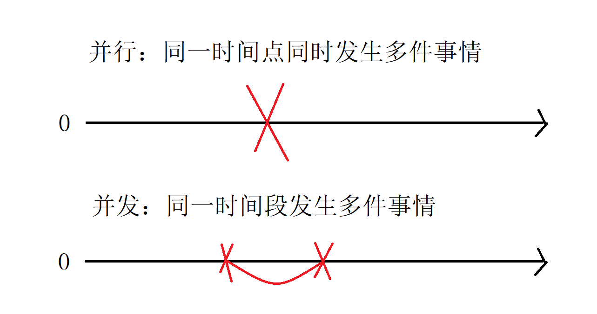
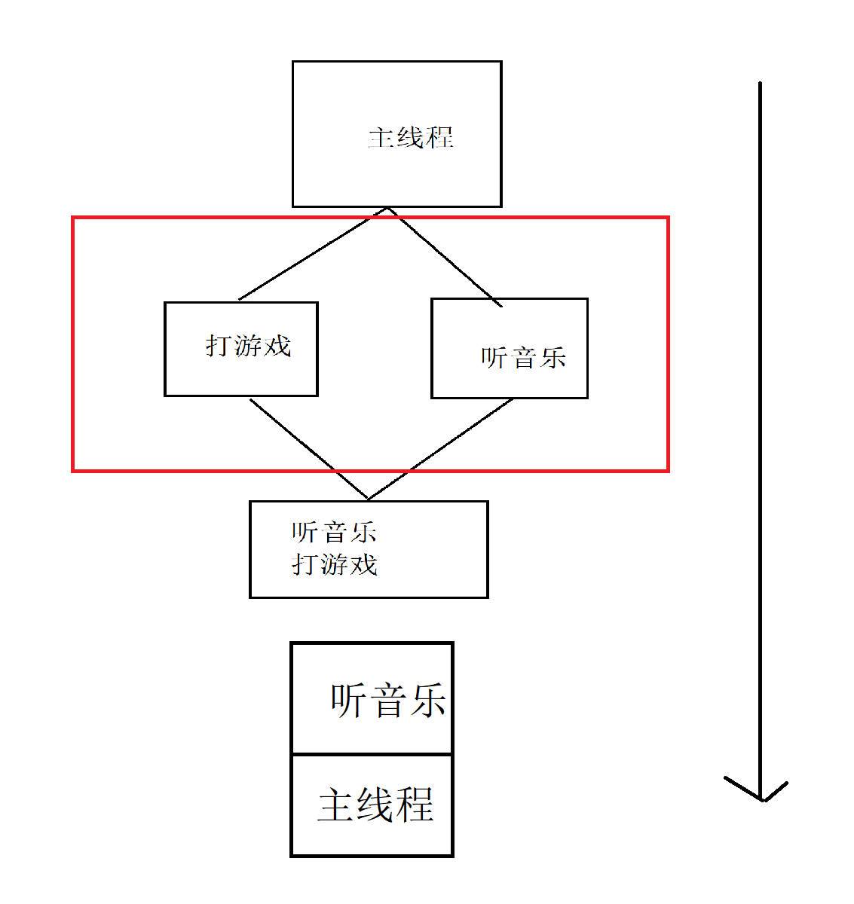

# 多线程

## 并行和并发

1. 需求：边打英雄联盟和边听音乐

2. 问题：只能先后关系，并不能同时发生

   - 多进程或者多线程来解决

3. 并行和并发：

   - 并行：多件事情在同一时刻发生

   - 并发：多件事情在同一时间段发生，同一时间段多个程序同时运行

     

4. 单个CPU：一个时间点只能执行一个程序，多个程序可以交替执行。
5. 线程调度：多个线程以某个顺序执行

## 进程与线程

1. 进程：内存中的应用程序，每个进程有一块独立的内存空间，一个应用程序可以同时启用多个进程，有独立内存空间，至少有一个线程
2. 线程：进程中的执行任务单元，一个进程里面可以拥有多个线程，栈空间独立，**堆内存共享**
3. 多线程的优势：因为堆内存是共享的，所以内存的开销是不是较少。
4. 多线程具体运行那个线程，取决于 CPU调度
5. java 程序中最少有几个线程：
   - 主线程
   - GC垃圾回收线程
6. 线程的调度：JVM 采用抢占式的调度方式，没有采用分时概念，谁抢到谁执行。
7. 多线程的应用：
   - 抢票
   - 游戏
   - 多线程下载
8. 宽带带宽：以位（bit）计算的，下载速度以字节（byte）,1字节=8位 
   - 1024KB/s 代表 1M，下载速度，1024/8 128KB/s

# 多线程实现方式

1. 继承 Thread 类

   - 重写 run 方法

     ```java
     public class MusicDemo extends Thread{
         @Override
         public void run() {
             for (int i = 0; i < 10; i++) {
                 System.out.println("听音乐："+i);
             }
         }
     
     }
     ```

     

   - 启动线程，调用 start 方法

     ```java
     MusicDemo musicDemo = new MusicDemo();
     musicDemo.start();
     ```

   - 注意：不要去调用 run() 方法

2. 实现 Runnable 接口

   - 实现Runnable 接口，实现 Run 方法

     ```java
     public class PlayGame implements Runnable {
         @Override
         public void run() {
             for (int i = 0; i < 10; i++) {
                 System.out.println("打游戏：" + i);
             }
         }
     }
     ```

   - 启动(先创建对象，再创建 Thread 对象通过构造器获得线程对象)

     ```java
     PlayGame playGame = new PlayGame();
     Thread thread = new Thread(playGame);
     thread.start();
     ```

3. 使用匿名内部类来创建线程（只适用于只使用一次的方式）

   ```java
   new Thread(new Runnable() {
               @Override
               public void run() {
                   for (int i = 0; i < 10; i++) {
                       System.out.println("统计人头数:" + i);
                   }
               }
           }).start();
   ```

   

# 线程的调度

1. **线程控制操作**：Thread.sleep(1000L);

2. 线程合并（联合线程）：

   - join方法(操作线程先执行完之后，等待线程才执行)

   

3. 守护线程：GC 使用

   - 目的：为其它线程服务的—GC—
   - 特点：主线程结束，守护线程就结束
   - 创建线程：默认是前台线程
   - 获取守护线程thread.setDaemon(true),必须再 start() 方法之前

4. 获取当前线程及其名称

   - Thread t = Thread.currentThread();
   - t.getName();

5. 线程设置优先级

   - 注意：优先级高，只不过是获取执行机会更大（取决于CPU调度）

     ```java
     /**
      * The minimum priority that a thread can have.
      */
     public final static int MIN_PRIORITY = 1;
     
     /**
      * The default priority that is assigned to a thread.
      */
     public final static int NORM_PRIORITY = 5;
     
     /**
      * The maximum priority that a thread can have.
      */
     public final static int MAX_PRIORITY = 10;
     ```

6. 线程的让位：

   - yield 方法：当前线程对象去提示CPU调度器自己愿意让出CPU资源（但是调度器可以忽略你的请求）
   - sleep 和 yield 方法的区别
     - 都能使当前处于运行状态的线程暂时放弃 cpu 把机会给其它线程
     - sleep 方法给其它线程运行机会，但是不考虑其它线程的优先级，yield 只会给相同优先级，或者更高优先级的线程运行机会
     - **调用 sleep 方法之后，线程进入计时等待状态，yield 进入就绪状态**

# 线程同步

1. 需求：猴子（3个 A B C）吃香蕉30个，使用多线程的方式实现

   - 继承 Thread 类的方式

     - 同一个编号的香蕉被多个猴子吃

       ```java
       public class MonkeyDemo extends Thread {
           private int num = 30;//香蕉总数
           @Override
           public void run() {
               for (int i = 0; i < 30; i++) {
                   if (num > 0) {
                       System.out.println(super.getName() + "吃了编号为：" + num-- + "的香蕉");
                   }
               }
           }
       }
       
       
       MonkeyDemo monkeyA = new MonkeyDemo();
       monkeyA.setName("A");
       
       MonkeyDemo monkeyB = new MonkeyDemo();
       monkeyB.setName("B");
       
       MonkeyDemo monkeyC = new MonkeyDemo();
       monkeyC.setName("C");
       
       monkeyA.start();
       monkeyB.start();
       monkeyC.start();}}
       ```

   - 实现 Runnable 接口

     - 是否可以共享同一个资源的原因，实现方式可以做到（当有网络延迟的时候，也不可以做到）

     ```java
     public class MonkeyRunnable implements Runnable{
     
         private int num = 30;
         @Override
         public void run() {
             for (int i = 0; i < 30; i++) {
                 if (num > 0) {
                     System.out.println(Thread.currentThread().getName() + "吃了编号为：" + num-- + "的香蕉");
                 }
             }
         }
     }
     
     MonkeyRunnable runnable = new MonkeyRunnable();
     
     new Thread(runnable,"A").start();
     new Thread(runnable,"B").start();
     new Thread(runnable,"C").start();
     ```

2. 解决多个猴子不能同时吃到同一个香蕉的案例

   - 同步代码块

     - 语法

     - 非静态

     - 同步锁是谁？

       - 非静态的来说，同步锁就是 this
       - 静态的来说，类的字节对象（MonkeyRunnable.class）

       ```java
       synchronized(同步锁){
       }
       ```

     - 为了保证每个线程都能够正常执行，原子操作，**一般的，把当前并发访问的共同资源作为同步监听对象**
     - 任何时候，只能运行一个线程拥有同步锁，谁拿到谁执行，其它的等待
     - 不要使用同步锁去修饰 run 方法，修饰之后，某一个线程执行完了其它的才可以执行

   - 同步方法

     ```java
     synchronized public void eat() {
         //业务逻辑
     }
     ```

   - 锁机制（Lock）:

     ```java
     Lock lock = new ReentrantLock();
     //上锁
     lock.lock();
             if (num > 0) {
                 System.out.println(Thread.currentThread().getName() + "吃了编号为：" + num-- + "的香蕉");
             }
     //解锁
     lock.unlock();
     ```

3. 同步代码块，同步方法，同步锁如何选用？

   - 尽量减少锁的作用域（Synchronized）
   - 建议使用锁机制（很好的去控制锁的作用范围，性能更高）

