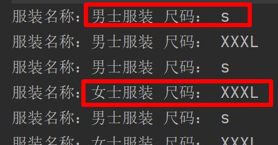
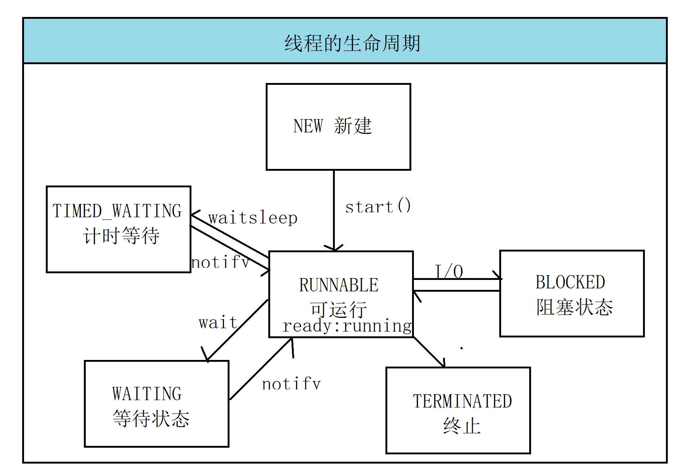

# 生产者与消费者模式

1. 线程通信：不同线程执行不同任务，如果这些任务存在关系，线程之间必须能够通信，协调完成工作

2. 需求：实现生产者与消费者模式

   - 通过生产者与消费者操作共同资源
   - 使用多个线程来做生产者（Producer）
   - 使用多个线程来做消费者（Consumer）

3. 生产者以及消费者示意图：（体现面向对象设计原则：低耦合）

   

   - 主板与集成显卡(高耦合)

     ```java
     //主板
     public class Producer{
         private Consumer cu;
     }
     
     //集成显卡
     public class Consumer{
         private Producer p;
     }
     ```

   - 主板和内存条（方便升级）（低耦合）

     ```java
     //主板
     public class Producer{
         //资源
         private ShareResource resource;
     }
     
     //内存
     public class Consumer{
         //资源
          private ShareResource resource;
     }
     
     //内存卡槽
     public class ShareResource{
         
     }
     ```

## 实现生产者与消费者

```java
public class Producer implements Runnable {

    private ShareResource resource;

    public Producer(ShareResource resource){
        this.resource = resource;
    }

    @Override
    public void run() {
        for (int i = 0; i < 20; i++) {
            if(i % 2 == 0){
                resource.push("女士服装","s");
            }else{
                resource.push("男士服装","XXXL");
            }
        }
    }
}
```


```java
public class Consumer implements Runnable{
    private ShareResource resource;

    public Consumer(ShareResource resource){
        this.resource = resource;
    }

    @Override
    public void run() {
        for (int i = 0; i < 20; i++) {
            resource.pop();
        }
    }
}
```


```java
public class ShareResource {

    private String name;

    private String size;

    /**
     * 给生产者推送数据的
     *
     * @param name
     * @param size
     */
    public void push(String name, String size) {
        this.name = name;
        try {
            Thread.sleep(1000L);
        } catch (InterruptedException e) {
            e.printStackTrace();
        }
        this.size = size;
    }

    public void pop() {
        try {
            Thread.sleep(1000L);
        } catch (InterruptedException e) {
            e.printStackTrace();
        }
        System.out.println("服装名称：" + this.name + " 尺码： " + this.size);
    }
}
```


## 生产者与消费者出现数据紊乱的问题



1. 问题1：出现数据紊乱问题
   - 解决方案：只要保证生产名字和尺码的过程中保持同步，中间不被消费者消费
     - 同步方法/同步代码块/锁来保持同步性
2. 问题2：应该生产一个数据消费一个数据
   - 应该交替出现，男士--XXL  女士--s 男士--xxl 女士--s
     - **使用等待唤醒机制**

## 线程通信

1. ​	线程通信（wait）和（notify） 方法介绍

   - wait():执行该方法的线程对象要释放同步锁，JVM 会把该线程放到**等待池**里面，等待其它的线程唤醒它
   - notify():执行该方法的线程唤醒在等待池中的线程，把线程转到**锁池**中去等待。
   - notifyAll():执行该方法的线程，唤醒在**等待池**中的所有线程，把这些线程转移到**锁池**中去等待。
   - 注意点：这些方法，只能被同步监听锁对象锁（**同步锁**）调用

2. 同步监听锁对象（同步锁）：多个线程有共同对象使用时，多个线程之间才会出现互斥现象，共同的这个对象就叫同步监听锁对象

3. 同步锁池：同步锁必须选择多个线程共同的资源对象，当生产者生产数据时（先获取锁），生产者没生产出来的时候，消费者只能等待（锁池等待），等生产者生产完，释放同步锁时，消费者此时就可以抢锁来进行消费。

4. P线程和C线程S对象（同步锁），P,C线程如何通信（wait notify）

   - P线程执行S对象的同步方法，P线程持有S对象的锁，C线程是不是在S对象的锁池中等待。
   - P线程生产完，执行 wait() ,释放S对象的锁，进入S对象的等待池中去等待生产。
   - S对象锁池中等待的C线程获取S对象的锁，执行S对象的消费同步方法。
   - C线程消费结束，执行完S对象的同步消费方法时，执行notify()唤醒P线程，JVM把P从S对象等待池中移到S对象的锁池中，等待获取锁，C 线程释放锁，P获取锁，继续循环。

   ```java
   public class ShareResource {
   
       private String name;
   
       private String size;
   
       private boolean isEmpty = true;//判断资源对象是否为空
   
       /**
        * 给生产者推送数据的
        *
        * @param name
        * @param size
        */
       synchronized public void push(String name, String size) {
   
           try {
               //判断资源对象是否为空，空的时候等待
               while (!isEmpty){
                   this.wait();
               }
               this.name = name;
               Thread.sleep(1000L);
               this.size = size;
               isEmpty = false;
           } catch (InterruptedException e) {
               e.printStackTrace();
           }finally {
               this.notify();//唤醒一个消费者
           }
   
       }
   
       synchronized public void pop() {
           try {
               //如果资源为空，消费者等待
               while (isEmpty){
                   this.wait();
               }
               Thread.sleep(1000L);
               System.out.println("服装名称：" + this.name + " 尺码： " + this.size);
               isEmpty = true;
               this.notify();
           } catch (InterruptedException e) {
               e.printStackTrace();
           }
   
       }
   }
   ```

   

5. Lock 和 Condition 接口：

   - wait 和 notify 只能被同步监听锁对象调用，否则报错，但是Lock 机制根本没有同步锁，也没有获取释放锁的逻辑。
   - 使用Condition 接口对象的 await singnal signalAll 方法取代 Object 类中的 wait notify notifyAll 方法

   ```java
   public class ShareResource {
   
       private String name;
   
       private String size;
   
       private boolean isEmpty = true;//判断资源对象是否为空
   
       private Lock lock = new ReentrantLock();
   
       private Condition condition = lock.newCondition();
   
       /**
        * 给生产者推送数据的
        *
        * @param name
        * @param size
        */
       public void push(String name, String size) {
           lock.lock();//获取锁
           try {
               //判断资源对象是否为空，空的时候等待
               while (!isEmpty){
                   condition.await();
               }
               this.name = name;
               Thread.sleep(1000L);
               this.size = size;
               isEmpty = false;
               condition.signalAll();
           } catch (InterruptedException e) {
               e.printStackTrace();
           }finally {
               lock.unlock();//释放锁
           }
   
       }
   
       public void pop() {
           lock.lock();//上锁
           try {
               //如果资源为空，消费者等待
               while (isEmpty){
                   condition.await();
               }
               Thread.sleep(1000L);
               System.out.println("服装名称：" + this.name + " 尺码： " + this.size);
               isEmpty = true;
               condition.signalAll();
           } catch (InterruptedException e) {
               e.printStackTrace();
           }finally {
               lock.unlock();//释放锁
           }
   
       }
   }
   ```

   

**建议：建议使用第二种方式**

# 死锁

1. 多线程通信时，很容易出现死锁现象，死锁并且是不能解决的，只能避免。
   - P线程等待有C线程持有的锁，而我们C线程又去等待P线程持有的锁，发生死锁现象，JVM不检测也不是图避免这种情况
2. 如何避免死锁：当我们多个线程去访问共享资源的时候 A,B,C，保证每一个线程都按照相同的顺序去访问。
3. Thread 类有一些过时的方法：
   - suspend() 使正在运行的线程放弃 CPU 暂停运行。
   - resume() 是暂停线程恢复运行
   - 这两方法很容易导致死锁，不要去使用
     - P线程获取锁对象，去执行同步方法，如果C线程调用P线程的暂停方法，此时P就会放弃CPU但是不释放锁。
   - 如何避免：**上锁---释放锁**

# 线程的生命周期

1. 生命周期：一个物品从出生---死亡

2. 线程的生命周期（Thread.State）：

   - NEW:使用new 创建线程对象的时候，只分配了空间，**调用 start() 方法的时候**，线程启动

   - RUNNABLE:（可运行状态）使用了 start 之后，变成了两种状态

     - ready:准备就绪，等待 cpu 的调度
     - running :获取到了 cpu 的调度

   - BLOCKED:(阻塞的状态)运行中的线程，因为某些原因，放弃了 cpu 暂停运行，此时 jvm 不会给线程分配 cpu

     - 当 P线程处于运行状态时，但是，没有获取到同步锁， JVM 就会把 P线程放到同步锁对象的锁池中去，P阻塞
     - 线程运行中发出（IO请求），此时阻塞

   - WAITING:（等待的状态）等待状态只能被其它线程唤醒，

     - 运行中的线程调用了 wait() 方法，此时 jvm 把当前的线程存放在对象等待池中

   - TIMED_WAITING:（计时等待）wait(long),sleep(long),就变成计时等待

     - 线程运行过程中，调用上面方法，此时 JVM把当前线程存在对象等待池中

   - TERMINATED:(停止)表示线程结束了

     - 正常的执行完线程
     - 出现异常

     

# 定时器

1.Timer 里面有一个常用的方法

```java
Timer timer = new Timer();
        timer.schedule(new TimerTask() {
            @Override
            public void run() {
                System.out.println("----");
            }
        },0,1000L);
```


# 线程组

1. 可以对线程集中管理，ThreadGroup

2. 用户创建线程对象时，可以通过构造器指定所属的线程组

   ```jav
   ThreadGroup groups = new ThreadGroup("商品上架线程组");
   ThreadGroup groups1 = new ThreadGroup("fihfiwehuif");
   GoodsThread a = new GoodsThread(groups, "A");
   a.start();
   new GoodsThread(groups,"B").start();
   new GoodsThread(groups1,"C").start();
   new GoodsThread("efwefewfewfe").start();
   
   public GoodsThread(ThreadGroup group, String name) {
      super(group,name);
   }
   ```

3. A线程中创建B线程，B线程默认加入A线程线程组

4. 默认创建的线程，都属于main 线程