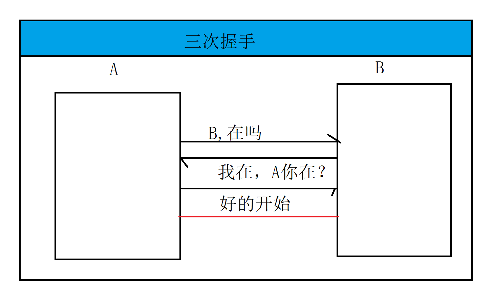

# 网络编程

## 网络概述

1. 什么是计算机网络：指将地理位置不同的具有独立功能的多台计算机及其设备，通过**通信线路**连接起来，在网络操作系统，网络管理软件及其网络通信协议的管理和协调下，**实现信息共享和资源传递**

2. 划分：

   - 网络划分：

     - 局域网
     - 广域网
     - 互联网

   - 网络分层：减少网络设计的复杂性，提供一个规范。不同机器上同等功能层必须采用相同的协议

     

   - **网络模型：使用OSI七层架构TCP和IP体系**

   - **TCP/IP ：是网络互联的通信协议**

     - 应用层：TELNET,FTP,SMTP等
     - 运输层：
       - **TCP**:是可靠的，通过三次握手来连接数据传输服务
       - **UDP**：不可靠的，是无连接的数据传输服务
     - 网络层：主要解决主机到主机之间的通信问题（网络协议，**IP**可靠的协议，**无连接**的数据传递服务）
     - 网络接口层：负责监视数据在主机和网络之间的交换

3. 套接字：源IP和目的IP以及端口号和目的端口号的组合，用来标识客户端请求的服务器和服务

4. 网络编程：使用套接字来达到进程间通信目的的编程就是网络编程

5. 进程间通信：同一电脑不同进程之间通信，（网络连接）A电脑中的进程和B电脑进程通信

6. java.net 包

## IP

1. ip:网络之间互联的协议

2. ip版本：

   - ipv4:192.168.2.12
   - ipv6:fe80::495a:afb0:a010:1442%7
   - ip 地址编址方案：
     - A（10.0.0.0）10.255.255.255
     - B（172.16.0.0）172.16.255.255
     - C（192.168.0.0）192.168.255.255

3. 本机地址

   - localhost
   - 127.0.0.1
   - 本机ip(cmd - ipconfig)

4. 实操

   ```java
   InetAddress ip = InetAddress.getByName("LAPTOP-IQLK33VN");
   System.out.println(ip.getHostName());
   System.out.println(ip.getHostAddress());
   ```

   

## PORT

1. 端口：设备和外界设备通信交流的出口
   - 常用端口：80,8080,3306,6379
2. 注意：**同一台电脑中，不能同时出现同一个端口，端口冲突**


## 协议

1. 协议：网络协议的简称，是计算机双方必须遵守的规则
2. **http:超文本传输协议（不收费）**
3. https:使用安全的套接字传输的超文本协议（收费）
4. ftp:文件传输协议
5. file:文件，本机电脑或者网上分享的文件

## URI 与 URL

1. URI：统一资源标识符，是用来标识某一个互联网资源名称的字符串
   - 包含：主机名，端口，标识符，相对uri
   - http://www.baidu.com/hello.html
2. URL:统一资源定位符，是互联网的标准资源地址
   - 包含：主机名，端口，标识符，具体路径
   - http://ip:80/home/index.png

## 传输层协议

1. TCP:面向连接（经历三次握手）、传输可靠（保证了数据正确性，数据顺序的正确性），用来传输数据量大，（流模式）、速度慢，建立连接开销大。**服务端和客户端**
2. UDP:面向非连接、传输不可靠（丢包（数据丢失））、用于传输少量数据（数据报包模式）、速度快。发送端和接收端



### TCP

```java
public class Client {

    public static void main(String[] args) throws IOException {
        Socket socket = new Socket("127.0.0.1", 9999);
        InputStream in = socket.getInputStream();
        Scanner scanner = new Scanner(in);
        while (scanner.hasNext()){
            System.out.println(scanner.next());
        }

        scanner.close();
        socket.close();
    }
}
```

```java
public class Server {

    public static void main(String[] args) throws IOException {
        //创建服务端，指定端口为9999
        ServerSocket socket = new ServerSocket(9999);

        System.out.println("服务端准备就绪");
        //获取客户端的连接请求，阻塞的。
        Socket accept = socket.accept();
        System.out.println("获取到客户端的连接："+accept.getInetAddress());
        PrintStream printStream = new PrintStream(accept.getOutputStream());
        printStream.print("你好，这里是服务端，感谢你的连接");
        printStream.close();

        socket.close();
    }
}
```

### UDP

```JAVA
public class Send {

    public static void main(String[] args) throws IOException {
        String data = "我是发送者";
        //创建发送端对象
        DatagramSocket datagramSocket = new DatagramSocket(10010);
        //发送数据
        DatagramPacket packet = new DatagramPacket(data.getBytes(),//发送的数据
                data.getBytes().length,//发送多长
                InetAddress.getLocalHost(),//目标发送地址
                110);//发送的端口

        datagramSocket.send(packet);
        datagramSocket.close();
    }
}

```

```JAVA
public class Receive {

    public static void main(String[] args) throws IOException {
        //创建接收对象
        DatagramSocket datagramPacket = new DatagramSocket(10010);
        byte[] buffer = new byte[1024];
        //接收数据
        DatagramPacket packet = new DatagramPacket(buffer, 1024);
        datagramPacket.receive(packet);
        String string = new String(buffer, 0, packet.getLength());
        System.out.println(string);

        datagramPacket.close();
    }
}
```


### 常见错误

```java
Exception in thread "main" java.net.BindException: Address already in use: Cannot bind
	at java.net.DualStackPlainDatagramSocketImpl.socketBind(Native Method)
	at java.net.DualStackPlainDatagramSocketImpl.bind0(DualStackPlainDatagramSocketImpl.java:80)
	at java.net.AbstractPlainDatagramSocketImpl.bind(AbstractPlainDatagramSocketImpl.java:94)
	at java.net.DatagramSocket.bind(DatagramSocket.java:392)
	at java.net.DatagramSocket.<init>(DatagramSocket.java:242)
	at java.net.DatagramSocket.<init>(DatagramSocket.java:299)
	at java.net.DatagramSocket.<init>(DatagramSocket.java:271)
	at cn.sycoder.UdpDemo.Send.main(Send.java:14)
```

